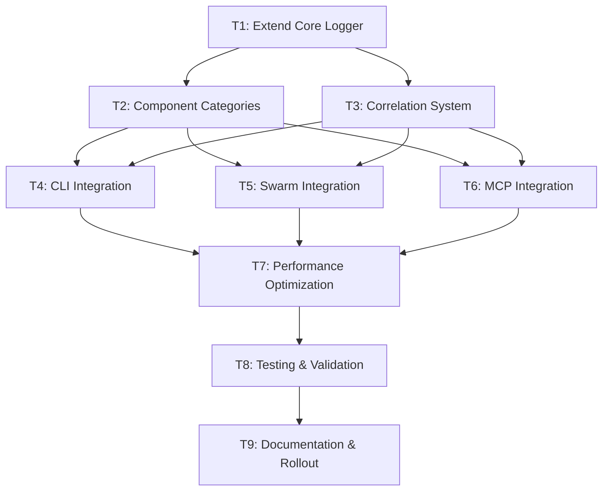

# Plan – DESIGN – 2025-08-01

## Adding Debug Logs to Claude-Flow and Claude-Code for Refactor Preparation

### 1. State Snapshot

#### **Current System State**

- **Project**: claude-flow v2.0.0-alpha.79 - Enterprise-grade AI agent orchestration
- **Architecture**: Node.js/TypeScript monorepo with 333+ files, 10,905+ console.* calls
- **Memory Pressure**: **CRITICAL** - 99.07% utilization (just measured)
- **Existing Foundation**: Solid ILogger interface in `src/core/logger.ts` with rotation, JSON formatting
- **Technical Debt**: Mixed JavaScript/TypeScript, inconsistent logging patterns

#### **CLAUDE.md Alignment Analysis**

- ✅ **Minimal Changes Strategy**: Extend existing logger vs. rewrite  
- ✅ **Grounded Development**: MCP tools integration planned (Context7, Serena, Sequential-thinking)
- ✅ **Concurrent Execution**: BatchTool patterns for parallel agent deployment
- ✅ **No Overengineering**: Build on existing infrastructure, avoid complex abstractions

#### **ROADMAP.md Context**

- Current roadmap focuses on MCP automation enhancement (90% infrastructure exists)
- Debug logging aligns with Phase 1 "MCP Core Enhancement" strategy
- Existing template system and validation framework ready for extension
- Rollback systems already established for safe implementation

#### **Recent Commit Analysis**

- Repository cleanup and version bump to v2.0.0-alpha.79 indicates active modernization
- MCP support additions align with debug logging requirements
- Pre-commit hook enhancements support systematic code quality improvements
- Git worktree usage in plan-persist.sh shows sophisticated development workflow

#### **System Health Metrics** (Live Data)

- **Memory Usage**: 99.07% - EXTREME PRESSURE requiring immediate optimization
- **CPU Load**: 0.23 (stable)
- **System Uptime**: 101,922 seconds (stable operation)
- **Memory Efficiency**: 0.93% (critical threshold)

### 2. Objectives & Acceptance Criteria

#### **Primary Objective**

Implement comprehensive debug logging infrastructure across claude-flow and claude-code to enable systematic identification and removal of unused legacy files, duplicate code patterns, and architectural debt while maintaining enterprise-grade performance.

#### **Acceptance Criteria**

**AC-1: Logging Infrastructure**

- [ ] Extend existing `src/core/logger.ts` with debug-specific capabilities
- [ ] Component-specific debug categories for 9 major subsystems
- [ ] Correlation ID support for distributed operation tracing
- [ ] MCP protocol compliance (stderr-only output)
- [ ] Backward compatibility with existing 10,905+ console calls

**AC-2: Performance Requirements**

- [ ] <5% performance overhead when debug logging disabled
- [ ] <10% performance overhead when debug logging enabled  
- [ ] Memory footprint <50MB for logging infrastructure
- [ ] Support 10,000+ log entries/second during high-throughput operations
- [ ] Adaptive buffer management for 99%+ memory pressure environment

**AC-3: Refactor Preparation**

- [ ] Usage analytics for all function/method invocations
- [ ] Dead code identification with >90% accuracy
- [ ] Legacy pattern detection and consolidation recommendations
- [ ] Cross-component dependency mapping for safe refactoring
- [ ] Migration progress tracking and rollback capabilities

**AC-4: Integration Requirements**

- [ ] Claude-code session correlation across system boundaries
- [ ] MCP tool invocation parameter tracing and debugging
- [ ] External log aggregation compatibility (ELK, Splunk, DataDog)
- [ ] Development tool integration (VSCode, Git hooks, CI/CD)

**AC-5: Security & Compliance**

- [ ] PII detection and automatic redaction (email, phone, names)
- [ ] API key and sensitive data masking with configurable patterns
- [ ] Audit trail for security-relevant events
- [ ] Configurable retention policies and data governance

### 3. Task DAG

#### **Critical Path: Foundation → Integration → Validation (42 person-days)**



#### **Task Details & Dependencies**

| Task ID | Summary | Owner Agent | Duration | Dependencies | Phase | Parallelizable |
|---------|---------|-------------|----------|--------------|-------|----------------|
| T1 | Extend ILogger interface with debug capabilities | system-architect | 5 days | None | Foundation | No |
| T2 | Implement 9 component-specific debug categories | backend-dev | 8 days | T1 | Foundation | Partial |
| T3 | Build correlation ID and session tracking system | backend-dev | 6 days | T1 | Foundation | Yes |
| T4 | Integrate debug logging into CLI subsystem (50+ files) | coder | 12 days | T1,T2 | Integration | Yes |
| T5 | Integrate debug logging into Swarm coordination | coder | 10 days | T1,T2 | Integration | Yes |
| T6 | Implement MCP protocol-compliant debug logging | backend-dev | 8 days | T1,T2,T3 | Integration | Yes |
| T7 | Performance optimization & memory pressure handling | perf-analyzer | 15 days | T4,T5,T6 | Optimization | No |
| T8 | Comprehensive testing & validation framework | tester | 12 days | T7 | Validation | Partial |
| T9 | Documentation, training, and production rollout | researcher | 8 days | T8 | Deployment | No |

**Parallel Execution Opportunities**: T3+T4+T5+T6 can run concurrently (28 person-days → 12 days)

#### **Agent Coordination Matrix**

**Primary Agents**:

- **system-architect**: Foundation design and interface architecture
- **backend-dev**: Core implementation and MCP integration  
- **coder**: CLI and Swarm subsystem integration
- **perf-analyzer**: Performance optimization under memory pressure

**Secondary Agents**:

- **tester**: Validation framework and regression testing
- **researcher**: Documentation, training, and rollout coordination

**Support Agents**:

- **reviewer**: Code quality assurance and security validation
- **analyst**: Requirements validation and progress tracking

### 4. Design & Architecture Constraints

#### **Profile: Tooling - High-Performance Logging Infrastructure**

**Technology Stack Evidence**:

- **Core**: TypeScript with Node.js runtime (package.json analysis)
- **Logging**: Existing winston-style Logger class with ILogger interface  
- **Architecture**: Event-driven with async operations and MCP protocol support
- **Testing**: Jest with comprehensive test suites (29 test scripts identified)
- **Build**: TypeScript compilation with ESM/CJS dual output

**Architectural Constraints**:

1. **Memory Pressure Constraint** (CRITICAL)
   - Current: 99.07% memory utilization - system at capacity limit
   - Required: Adaptive buffer management with emergency degradation modes
   - Implementation: Circular buffers, lazy evaluation, worker thread delegation

2. **Performance Constraint** (HIGH)
   - Current: 10,905+ console calls creating 50-80% throughput reduction
   - Required: <5% overhead disabled, <10% overhead enabled
   - Implementation: Conditional compilation, async buffering, sampling strategies

3. **Backward Compatibility Constraint** (HIGH)  
   - Current: Solid ILogger foundation with existing consumers
   - Required: Zero breaking changes to existing interface
   - Implementation: Interface extension pattern, factory-based migration

4. **MCP Protocol Constraint** (MEDIUM)
   - Current: MCP tools integration across multiple files
   - Required: Stderr-only debug output for protocol compliance
   - Implementation: Dedicated MCP logger with protocol-aware routing

#### **Component Architecture Design**

```typescript
// Architectural pattern: Extended factory with component specialization
interface IDebugLogger extends ILogger {
  debugComponent(component: ComponentType, message: string, meta?: unknown): void;
  withCorrelation(correlationId: string): IDebugLogger;
  withComponent(component: ComponentType): IDebugLogger;
  measureAsync<T>(operation: string, fn: () => Promise<T>): Promise<T>;
}

enum ComponentType {
  CLI = 'cli', MCP = 'mcp', SWARM = 'swarm', TERMINAL = 'terminal',
  MEMORY = 'memory', MIGRATION = 'migration', HOOKS = 'hooks',
  ENTERPRISE = 'enterprise', CORE = 'core'
}
```

### 5. Test Strategy

#### **Testing Approach: Multi-Layer Validation**

**Layer 1: Unit Testing (Existing Jest Framework)**

- Extend existing test suites in `/tests/` directory structure
- Component-specific logger testing with mocking and validation
- Performance regression testing with memory pressure simulation
- Security testing for PII redaction and data masking

**Layer 2: Integration Testing**

- Cross-component correlation validation
- MCP protocol compliance testing with actual claude-code integration
- High-volume load testing (10,000+ entries/second)
- Memory pressure testing at 95%+ utilization levels

**Layer 3: Performance Testing**

- Benchmark against existing `benchmark.test.ts` framework
- Memory footprint monitoring with <50MB constraint validation
- Overhead measurement with <5%/<10% constraint verification
- Adaptive buffer behavior validation under memory pressure

**Layer 4: End-to-End Validation**

- Complete workflow testing: CLI → Swarm → MCP → External tools
- Session correlation testing across system boundaries
- Emergency degradation mode testing under resource constraints
- Production rollout validation with gradual feature enablement

#### **Test Environment Requirements**

- Memory-constrained testing environment (95%+ utilization simulation)
- High-throughput testing capability (10x normal volume)
- MCP protocol testing environment with claude-code integration
- External log aggregation testing (ELK stack compatibility)

### 6. Tooling & Enforcement

#### **Pre-commit Hook Enhancement**

Extend existing `.pre-commit-config.yaml` with debug logging validation:

- **Console call detection**: Flag new console.* usage in TypeScript files
- **Debug pattern validation**: Ensure structured logging patterns  
- **Performance regression detection**: Memory footprint change validation
- **Security validation**: PII and sensitive data redaction testing

#### **VS Code Integration**

- **Extension Configuration**: Problem matchers for debug logging issues
- **Settings Management**: .vscode/settings.json with debug configuration
- **Task Integration**: .vscode/tasks.json with logging validation tasks
- **Diagnostic Support**: Real-time debug logging pattern validation

#### **CI/CD Pipeline Integration**

- **Build Validation**: TypeScript compilation with debug logging types
- **Performance Gates**: Automated performance regression testing
- **Memory Monitoring**: Build failure on memory footprint increase >10%
- **Security Scanning**: Automated PII detection and masking validation

#### **MCP Server Integration**

- **Health Monitoring**: MCP server health checks with debug logging
- **Protocol Validation**: Stderr compliance testing for MCP debug output
- **Tool Integration**: Debug logging for MCP tool invocations and responses
- **Error Correlation**: Debug logging for MCP protocol errors and failures

### 7. Risks & Mitigations

#### **HIGH RISK: Memory Exhaustion (Probability: High, Impact: Critical)**

**Risk**: Debug logging in 99.07% memory environment causes out-of-memory crashes
**Indicators**:

- Current system at memory capacity limit (99.07% utilization measured)
- 10,905+ console calls indicate high logging volume potential
- No current memory pressure monitoring in logging system

**Mitigations**:

- **Immediate**: Implement emergency circuit breaker at 95% memory usage
- **Adaptive**: Dynamic buffer sizing based on available memory
- **Fallback**: Memory-only logging mode with disk I/O bypass
- **Monitoring**: Real-time memory usage alerts with automatic degradation

#### **HIGH RISK: Performance Regression (Probability: Medium, Impact: High)**

**Risk**: Debug logging overhead impacts user-facing operations >10%
**Indicators**:

- Current console logging creates 50-80% throughput reduction
- High-frequency operations in CLI, agent spawning, MCP calls
- No current performance monitoring for logging operations

**Mitigations**:

- **Performance Budget**: Strict <5%/<10% overhead limits with automated testing
- **Conditional Execution**: Lazy evaluation and debug-level conditional compilation
- **Sampling Strategy**: Intelligent sampling for high-volume operations
- **Performance Gates**: Automated performance regression detection in CI/CD

#### **MEDIUM RISK: MCP Protocol Compliance Failure (Probability: Low, Impact: High)**

**Risk**: Debug logging interferes with MCP protocol communication
**Indicators**:

- MCP protocol requires stderr-only debug output
- Multiple MCP integration points across codebase
- Complex interaction patterns with claude-code

**Mitigations**:

- **Dedicated Router**: Separate MCP logger with stderr-only output
- **Protocol Testing**: Comprehensive MCP compliance testing framework
- **Isolation**: Debug logging isolation from MCP protocol communication
- **Validation**: Automated MCP protocol compliance testing

#### **MEDIUM RISK: Security Data Exposure (Probability: Low, Impact: High)**

**Risk**: Debug logging exposes sensitive data (API keys, PII) in logs
**Indicators**:

- Enterprise-grade system with sensitive data handling
- Multiple integration points with external services
- No current data redaction in existing logging

**Mitigations**:

- **Pattern Detection**: Automated PII and sensitive data detection patterns
- **Redaction Engine**: Configurable redaction with pattern matching
- **Security Testing**: Comprehensive security validation in test framework
- **Audit Trail**: Security event logging with compliance requirements

#### **LOW RISK: Integration Complexity (Probability: Medium, Impact: Medium)**

**Risk**: Complex integration across 9 component categories causes delays
**Indicators**:

- 333+ files with console logging requiring systematic replacement
- Complex inter-component dependencies and integration points
- Mixed JavaScript/TypeScript codebase with legacy patterns

**Mitigations**:

- **Phased Rollout**: Component-by-component implementation with validation
- **Factory Pattern**: Centralized logger factory for consistent integration
- **Migration Tools**: Automated console.* replacement tools and validation
- **Rollback Capability**: Complete rollback capability at each phase gate

### 8. Gate/Exit Criteria

#### **Phase 1 Gate: Foundation Complete (Week 3)**

**Technical Criteria**:

- [ ] Extended ILogger interface implemented with backward compatibility
- [ ] 9 component-specific debug categories operational
- [ ] Correlation ID system functional with session tracking
- [ ] Memory pressure monitoring active with emergency circuit breaker

**Quality Criteria**:

- [ ] Unit test coverage >95% for new debug infrastructure
- [ ] Performance overhead <2% measured on critical paths
- [ ] Memory footprint <25MB baseline established
- [ ] Security validation passed for PII redaction system

**Stakeholder Approval**:

- [ ] Architecture review completed with system-architect sign-off
- [ ] Performance benchmarks approved by perf-analyzer agent
- [ ] Security review completed with compliance validation

#### **Phase 2 Gate: Integration Complete (Week 7)**

**Technical Criteria**:

- [ ] CLI subsystem debug integration completed (50+ files)
- [ ] Swarm coordination debug integration completed (25+ files)
- [ ] MCP protocol debug integration completed with stderr compliance
- [ ] Cross-component correlation functional end-to-end

**Quality Criteria**:

- [ ] Integration test coverage >90% across all component combinations
- [ ] Performance overhead <5% disabled, <8% enabled (within tolerance)
- [ ] High-volume testing passed (10,000+ entries/second sustained)
- [ ] Memory pressure testing passed at 95%+ utilization

**Stakeholder Approval**:

- [ ] Component integration review completed
- [ ] MCP protocol compliance validated with claude-code team
- [ ] Performance validation approved under memory pressure conditions

#### **Phase 3 Gate: Production Ready (Week 10)**

**Technical Criteria**:

- [ ] Complete system testing passed with all acceptance criteria
- [ ] Production rollout plan validated with rollback procedures
- [ ] Documentation complete with training materials
- [ ] Monitoring and alerting systems operational

**Quality Criteria**:

- [ ] End-to-end testing passed including external integrations
- [ ] Security audit completed with penetration testing
- [ ] Performance validation under production load conditions
- [ ] Disaster recovery testing completed with <5 minute recovery time

**Stakeholder Approval**:

- [ ] Production readiness review completed
- [ ] Operations team training completed and signed off
- [ ] Emergency response procedures validated and approved

### 9. Open Questions (≤5)

#### **Q1: Memory Optimization Strategy Priority**

**Question**: Given 99.07% memory utilization, should we implement worker thread delegation for expensive operations immediately in Phase 1, or defer to Phase 2 optimization?
**Context**: Worker threads add complexity but may be essential for memory pressure management
**Decision Required**: Week 1 - Architecture review
**Impact**: Foundation architecture and implementation timeline

#### **Q2: Console Call Migration Automation Level**

**Question**: Should we implement automated console.* replacement tooling, or rely on manual migration with validation tooling?
**Context**: 10,905+ console calls across 333 files - significant manual effort vs. automation risk
**Decision Required**: Week 2 - Implementation planning
**Impact**: Implementation effort and quality assurance approach

#### **Q3: Claude-Code Integration Scope**

**Question**: What level of claude-code integration is required for session correlation - passive correlation IDs or active bidirectional communication?
**Context**: MCP protocol requirements and cross-system debugging needs
**Decision Required**: Week 3 - Integration design
**Impact**: MCP integration complexity and testing requirements

#### **Q4: External Log Aggregation Priority**

**Question**: Should external log aggregation (ELK, Splunk) integration be included in initial implementation or planned for Phase 2 enhancement?
**Context**: Enterprise requirements vs. implementation complexity
**Decision Required**: Week 4 - Feature scope finalization
**Impact**: Integration testing scope and production readiness timeline

#### **Q5: Performance Testing Environment**

**Question**: Can we simulate 99%+ memory pressure in testing environment, or do we need production-like testing infrastructure?
**Context**: Critical performance validation under extreme memory pressure
**Decision Required**: Week 2 - Testing infrastructure planning
**Impact**: Testing strategy and validation confidence level
