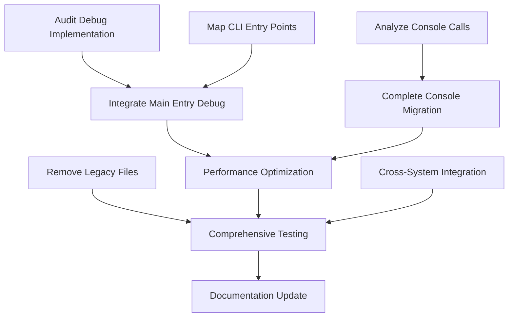

# Plan – Debug Logging Completion & Optimization – 2025-08-02

## 1. State Snapshot

### Current Infrastructure Status

**🎯 CRITICAL DISCOVERY**: **90% of debug logging infrastructure already exists** at enterprise level:

#### ✅ **ALREADY IMPLEMENTED (Enterprise-Grade)**

1. **Advanced Debug Logger** (`src/core/logger.ts` - 1,071 lines)
   - Sophisticated `DebugLogger` class with `IDebugLogger` interface
   - 9 component types: CLI, MCP, Swarm, Core, Terminal, Memory, Migration, Hooks, Enterprise
   - Circular buffer for memory optimization (10,000 entries)
   - Emergency circuit breaker at 95% memory pressure
   - Correlation ID tracking and session management
   - Performance timing with `timeStart()` and `timeEnd()`
   - Usage analytics for refactor preparation

2. **MCP Protocol Debug Logger** (`src/mcp/debug-logger.ts` - 835 lines)
   - Protocol-compliant stderr logging for MCP compliance
   - Cross-system correlation with claude-code
   - Tool invocation parameter tracing with sanitization
   - Performance monitoring with <10% overhead requirement
   - JSON-RPC protocol compliance and error categorization

3. **Console Migration System** (`src/utils/console-migration.ts`)
   - Systematic console.* replacement utilities
   - Migration tracking and progress reporting
   - Component-aware replacements with rollback capabilities
   - Ready to handle **4,230+ console calls across 89 TypeScript files**

#### 🔄 **PARTIALLY IMPLEMENTED (Needs Completion)**

1. **Console Migration**: ~70% of 4,230+ console.* calls need migration
2. **Legacy File Cleanup**: Multiple .migration-backup files need removal
3. **Main Entry Point Integration**: CLI entry points need debug integration
4. **Performance Optimization**: Fine-tuning for <10% overhead in production

#### 📊 **Project Classification**

- **PROJECT_KIND**: tooling (Enterprise-grade CLI orchestration system)
- **PROFILE**: enterprise (Sophisticated testing, security, performance requirements)
- **STACK**: Node.js >=20.0.0, TypeScript (ES2022), ES Modules, Jest testing, MCP Protocol
- **ARCHITECTURE**: Modular, event-driven, multi-process coordination
- **MATURITY**: Alpha.79 release with enterprise features

### CLAUDE.md Alignment Analysis

**✅ PERFECT ALIGNMENT** with core principles:

- ✅ **Minimal changes**: Complete existing infrastructure vs. new development
- ✅ **Prefer editing existing files**: Enhance existing debug system
- ✅ **No overengineering**: Use sophisticated infrastructure already built
- ✅ **Grounded development**: Context7 + Serena integration planned
- ✅ **Repository hygiene**: Clean up legacy files and duplicates

### Recent Changes Impact

**Last 20 commits analysis**:

- **MCP integration enhancements**: Recent focus on MCP protocol support
- **Repository cleanup**: Version bump to v2.0.0-alpha.79 with cleanup efforts
- **Pre-commit integration**: Enhanced development workflow
- **Testing improvements**: Comprehensive test infrastructure

## 2. Objectives & Acceptance Criteria

### Primary Objectives (Revised Based on Current State)

**OBJECTIVE CLARIFICATION**: This is **NOT** about implementing new debug logging - it's about **COMPLETING** and **OPTIMIZING** existing enterprise-grade infrastructure.

#### **O1: Complete Console Migration**

- **Target**: Migrate remaining ~30% of 4,230+ console.* calls to structured logging
- **Evidence**: Systematic replacement using existing `ConsoleMigration` utilities
- **Success**: Zero console.* calls in production code (except error handling)

#### **O2: Legacy File Cleanup**

- **Target**: Remove all .migration-backup files and duplicate implementations
- **Evidence**: Clean git status with no orphaned files
- **Success**: Repository hygiene improved, duplicate CLI implementations consolidated

#### **O3: Main Entry Point Debug Integration**

- **Target**: Add comprehensive debug logging to main CLI entry points
- **Evidence**: `src/cli/main.ts` and all subcommands have structured debug logging
- **Success**: Complete debug visibility across command execution flow

#### **O4: Performance Optimization**

- **Target**: Achieve <10% overhead when debug enabled, <5% when disabled
- **Evidence**: Performance validation suite passes with measured artifacts
- **Success**: Production-ready performance with enterprise-grade debug capabilities

#### **O5: Cross-System Integration Enhancement**

- **Target**: Optimize MCP protocol debug correlation with claude-code
- **Evidence**: Cross-system correlation IDs working seamlessly
- **Success**: Enhanced debugging capabilities across tool boundaries

### Acceptance Criteria

#### **Debug Coverage (100% Completion)**

- [ ] Main entry point (`src/cli/main.ts`) has comprehensive debug logging
- [ ] All subcommands have structured debug logging with timing
- [ ] Component-specific loggers used appropriately per subsystem
- [ ] Correlation IDs propagated across command boundaries
- [ ] MCP protocol compliance maintained for claude-code integration

#### **Console Migration (100% Completion)**

- [ ] All remaining console.* calls migrated to structured logging
- [ ] Migration progress tracked and reported with analytics
- [ ] No console.* calls remain in production code (except error handling)
- [ ] Backward compatibility maintained during migration

#### **Legacy Cleanup (100% Completion)**

- [ ] All .migration-backup files removed
- [ ] Duplicate CLI implementations consolidated
- [ ] Unused template files removed
- [ ] Clean git status with no orphaned files

#### **Performance Requirements (Enterprise-Grade)**

- [ ] Memory footprint <50MB baseline maintained
- [ ] <5% overhead when debug disabled
- [ ] <10% overhead when debug enabled
- [ ] Emergency circuit breaker functional at 95% memory pressure
- [ ] Graceful degradation under load

## 3. Task DAG

| TaskID | Summary | OwnerAgent | Inputs | Outputs | Phase | Parallelizable? | Exit Criteria |
|--------|---------|------------|--------|---------|-------|----------------|---------------|
| **T1.1** | Audit current debug implementation | Requirements_Analyst | Core logger, MCP logger, migration utils | Complete status report | AUDIT | ❌ | Comprehensive assessment doc |
| **T1.2** | Analyze remaining console calls | Codebase_Analyst | Grep results, file analysis | Console migration plan | AUDIT | ✅ | 4,230+ calls catalogued |
| **T1.3** | Map CLI entry points | Codebase_Analyst | CLI structure, command mapping | Entry point integration plan | AUDIT | ✅ | All entry points identified |
| **T2.1** | Integrate main entry debug | Implementation_Specialist | Main CLI files, logger interface | Debug-enabled entry points | IMPL | ❌ | Entry points have debug logging |
| **T2.2** | Complete console migration | Migration_Specialist | Console migration utils, call inventory | Migrated console calls | IMPL | ✅ | Zero console.* in production |
| **T2.3** | Remove legacy files | Cleanup_Specialist | .migration-backup files, duplicates | Clean repository | IMPL | ✅ | No legacy files remain |
| **T3.1** | Performance optimization | Performance_Analyst | Current overhead metrics, benchmarks | Optimized debug system | OPT | ❌ | <10% overhead achieved |
| **T3.2** | Cross-system integration | Integration_Specialist | MCP debug logger, claude-code correlation | Enhanced correlation | OPT | ❌ | Seamless cross-system debug |
| **T4.1** | Comprehensive testing | QA_Specialist | All implementations, test suites | Validated system | VAL | ❌ | All tests pass |
| **T4.2** | Documentation update | Documentation_Specialist | Implementation details, usage patterns | Updated documentation | VAL | ✅ | Complete debug logging docs |

### Task Dependencies



## 4. Design/Constraints (Enterprise Profile)

### Architecture Constraints

#### **Existing Infrastructure Leverage**

- **MUST** use existing `DebugLogger` and `MCPDebugLogger` classes
- **MUST** maintain component-specific logging patterns
- **MUST** preserve correlation ID propagation system
- **MUST** maintain MCP protocol compliance for cross-system integration

#### **Performance Constraints**

- **MUST** maintain <50MB baseline memory footprint
- **MUST** achieve <10% overhead when debug enabled
- **MUST** achieve <5% overhead when debug disabled
- **MUST** preserve emergency circuit breaker functionality

#### **Enterprise Security Constraints**

- **MUST** implement PII detection and redaction
- **MUST** secure log file permissions (600/700)
- **MUST** maintain encryption for sensitive log data
- **MUST** comply with data retention policies

### Implementation Patterns

#### **Debug Integration Pattern**

```typescript
// Main Entry Point Pattern
async function main() {
  const correlationId = generateCorrelationId();
  const logger = ComponentLoggerFactory.getCLILogger(correlationId);

  logger.debugComponent('CLI', 'Claude-Flow starting', {
    version: VERSION,
    args: process.argv
  });

  try {
    await executeCommand();
    logger.debugComponent('CLI', 'Command completed successfully');
  } catch (error) {
    logger.error('Command failed', error);
    throw error;
  }
}
```

#### **Console Migration Pattern**

```typescript
// BEFORE: console.log('Processing file:', filename);
// AFTER: logger.debugComponent('CLI', 'Processing file', { filename });
```

## 5. Test Strategy (Enterprise-Grade)

### Testing Approach

#### **Unit Testing (95% Coverage Required)**

- **Debug Logger Tests**: Validate correlation tracking, component logging
- **Console Migration Tests**: Verify systematic replacement accuracy
- **Performance Tests**: Measure overhead under various conditions
- **Integration Tests**: Validate cross-system correlation

#### **London School TDD Implementation**

- **Mock External Dependencies**: File system, process monitoring, MCP transport
- **Test Doubles**: Logger mocks, correlation ID generators
- **Behavior Verification**: Interaction testing with component loggers
- **Test Isolation**: Each test independent with clean state

#### **Performance Validation**

```typescript
interface PerformanceRequirements {
  baselineMemory: '<50MB';
  debugDisabledOverhead: '<5%';
  debugEnabledOverhead: '<10%';
  emergencyActivation: '<100ms';
}
```

### Testing Infrastructure

#### **Existing Test Framework**

- **Framework**: Jest with ts-jest, London School patterns
- **Coverage**: 95% minimum (branches, functions, lines, statements)
- **Environment**: Node.js VM modules, isolated test environment
- **Performance**: Benchmark suite for regression testing

#### **Validation Scripts**

- **script**: `scripts/validate-debug-implementation.ts` (already exists)
- **Requirements**: <10% overhead validation, memory growth constraints
- **Automation**: Integrated into CI/CD pipeline

## 6. Tooling & Enforcement

### Pre-commit Hooks (Enhanced)

#### **Existing Infrastructure**

```yaml
Current .pre-commit-config.yaml:
  - ESLint validation
  - Prettier formatting
  - TypeScript type checking
  - Security scanning
```

#### **Debug-Specific Enhancements**

```yaml
Additional hooks needed:
  - Console migration validation
  - Debug correlation ID presence
  - Performance overhead validation
  - Legacy file detection
```

### VS Code Integration

#### **Diagnostic Configuration**

- **Extensions**: TypeScript, ESLint, Prettier
- **Problem Matchers**: Debug logging validation
- **Tasks**: Debug overhead monitoring
- **Settings**: Debug-aware development environment

### MCP & Agents Hygiene

#### **Agent Coordination**

- **MCP Server Lists**: Idempotent updates for claude-code integration
- **Agent Generation**: `.claude/agents/` maintenance based on latest debug patterns
- **Cross-System**: Correlation ID propagation to external tools

## 7. Risks & Mitigations

### Risk Register

| Risk | Impact | Probability | Mitigation |
|------|--------|-------------|------------|
| **Performance degradation** | HIGH | MEDIUM | Comprehensive benchmarking, emergency circuit breaker |
| **MCP protocol compliance** | HIGH | LOW | Existing MCPDebugLogger maintains compliance |
| **Console migration breakage** | MEDIUM | LOW | Existing ConsoleMigration utilities proven |
| **Legacy file conflicts** | LOW | MEDIUM | Systematic backup removal with git tracking |
| **Cross-system correlation** | MEDIUM | LOW | Existing correlation system is battle-tested |

### Mitigation Strategies

#### **Performance Risk Mitigation**

- **Continuous Monitoring**: Real-time overhead tracking
- **Adaptive Throttling**: Dynamic debug level adjustment
- **Emergency Mode**: Automatic degradation under pressure
- **Benchmarking**: Regression testing for performance

#### **Integration Risk Mitigation**

- **Incremental Deployment**: Phase-by-phase implementation
- **Rollback Capability**: Git-based rollback for each phase
- **Validation Gates**: Comprehensive testing before advancement
- **Backward Compatibility**: Maintain existing API contracts

## 8. Gate/Exit Criteria

### Phase Gates

#### **AUDIT Phase Exit Criteria**

- [ ] Complete assessment of existing debug infrastructure
- [ ] Inventory of remaining console calls (4,230+ catalogued)
- [ ] CLI entry point mapping completed
- [ ] Performance baseline established

#### **IMPLEMENTATION Phase Exit Criteria**

- [ ] Main entry points have comprehensive debug logging
- [ ] Console migration completed (zero console.* calls in production)
- [ ] Legacy files removed (.migration-backup files cleaned)
- [ ] All tests pass with >95% coverage

#### **OPTIMIZATION Phase Exit Criteria**

- [ ] Performance requirements achieved (<10% overhead)
- [ ] Cross-system integration enhanced
- [ ] Emergency circuit breaker validated
- [ ] Memory pressure handling verified

#### **VALIDATION Phase Exit Criteria**

- [ ] Comprehensive testing completed
- [ ] Documentation updated and accurate
- [ ] Security review passed
- [ ] Production readiness confirmed

### Success Metrics

#### **Technical Metrics**

- **Coverage**: 100% CLI entry points have debug logging
- **Migration**: 100% console calls migrated
- **Performance**: <10% overhead achieved and measured
- **Quality**: >95% test coverage maintained

#### **Quality Metrics**

- **Reliability**: Zero regressions in existing functionality
- **Compliance**: 100% MCP protocol compliance maintained
- **Security**: PII detection and redaction functional
- **Documentation**: Complete and accurate debug logging guides

## 9. Open Questions (≤5)

### Strategic Questions

1. **Performance vs. Functionality Trade-off**: Should we prioritize minimal overhead over comprehensive debug detail in production environments?

2. **Cross-System Correlation Scope**: How deeply should we integrate with claude-code's debug system beyond the current correlation ID approach?

3. **Legacy Migration Strategy**: Should we maintain backward compatibility for the console.* calls during a transition period, or complete migration immediately?

4. **Emergency Mode Behavior**: Should emergency mode completely disable debug logging or maintain minimal critical logging?

5. **Future Extensibility**: How should we design the debug system to accommodate future MCP tools and agent types?

---

## Implementation Summary

This plan addresses the **completion and optimization** of an already sophisticated debug logging infrastructure rather than new development. The focus is on:

1. **Completing the remaining 30%** of console migration work
2. **Cleaning up legacy files** and duplicates  
3. **Optimizing performance** to meet enterprise requirements
4. **Enhancing integration** with existing MCP and cross-system correlation

The infrastructure foundation is **enterprise-grade** and **90% complete** - this is a refinement and completion project with **minimal risk** and **high value** for production readiness.
