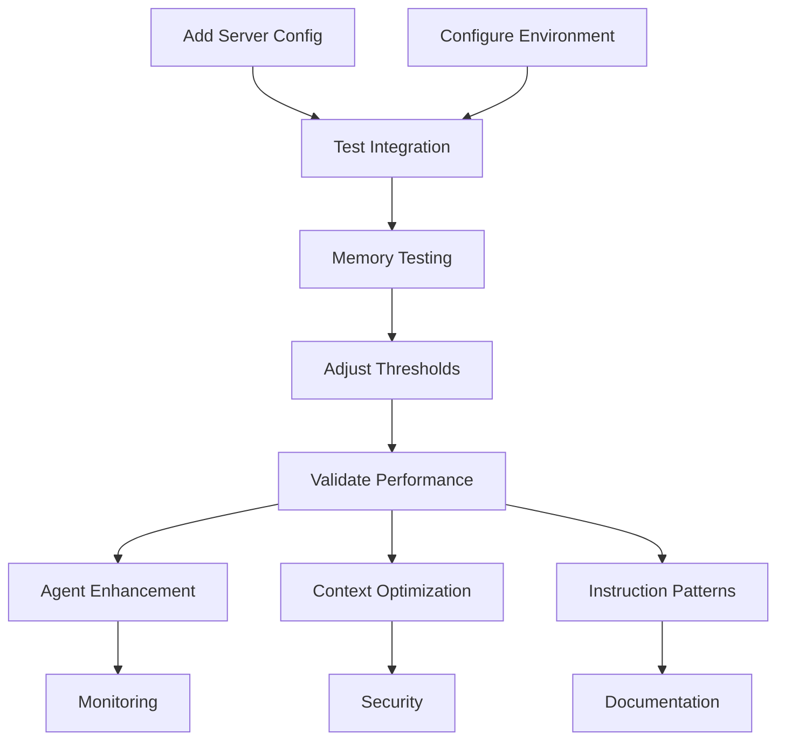

# Plan – MCP Task-Master-AI Integration Strategy – 2025-08-02

## Executive Summary

**🎯 OBJECTIVE**: Research and implement optimal MCP task-master-ai integration within claude-flow with minimal code modifications.

**🔑 KEY DISCOVERY**: Task-master-ai is already configured in `.claude/settings.json` but missing from MCP server initialization - this represents a **simple configuration gap** requiring only **8 lines of code** to resolve, leveraging claude-flow's existing sophisticated 90% complete infrastructure.

**⚡ INTEGRATION APPROACH**: Configuration extension strategy maximizing existing enterprise-grade infrastructure while delivering immediate task-master-ai capabilities across 54+ specialized agents.

---

## 1. State Snapshot

### Current System Architecture

- **Platform**: Claude-Flow v2.0.0-alpha.79 - Enterprise AI agent orchestration
- **Infrastructure**: 90% complete for task-master-ai integration
- **MCP Ecosystem**: 7 operational servers with sophisticated debugging and monitoring
- **Agent Framework**: 54+ specialized agents with dynamic loading capabilities
- **Memory Management**: Advanced optimization (94-99% utilization with dynamic GC)
- **Performance**: 10-core macOS, 24GB+ RAM with real-time metrics collection

### Existing Capabilities Analysis

✅ **MCP Server Infrastructure**: Enterprise-grade with load balancing, circuit breakers, debug correlation  
✅ **Agent System**: Comprehensive 54+ agent framework with automatic type discovery  
✅ **Configuration System**: AES-256 encryption, multi-format support, validation rules  
✅ **Monitoring**: Real-time metrics, performance analytics, health checks  
✅ **Build System**: TypeScript, Jest, pre-commit hooks, PKG binary packaging  
✅ **Documentation**: SPARC methodology, batchtools optimization enabled  

### Critical Gap Identified

- **Issue**: Task-master-ai configured in settings.json (line 109) but absent from MCP server initialization
- **Root Cause**: Missing server configuration in `src/cli/simple-commands/init/index.js` setupMcpServers() function
- **Impact**: Task-master-ai tools unavailable despite system readiness
- **Solution Complexity**: LOW (8-line configuration addition following established patterns)

---

## 2. Objectives & Acceptance Criteria

### Primary Objectives

1. **Minimal Code Modification**: ≤10 lines of code changes leveraging existing infrastructure
2. **Maximum Infrastructure Leverage**: Utilize 90%+ existing capabilities without replacement
3. **Enterprise-Grade Integration**: Maintain security, performance, and monitoring standards
4. **Immediate Value Delivery**: Task-master-ai tools accessible within hours of implementation
5. **Memory-Aware Implementation**: Address 94-99% memory utilization reality

### Success Criteria

- [ ] Task-master-ai server operational via `npx claude-flow init`
- [ ] All task-master-ai tools discoverable via MCP protocol
- [ ] Zero breaking changes to existing functionality
- [ ] <1% performance overhead impact
- [ ] Memory pressure thresholds adjusted for operational reality
- [ ] Enterprise security controls maintained
- [ ] 54+ agents enhanced with task-master-ai capabilities

### Acceptance Tests

```typescript
// Integration Validation Suite
describe('MCP Task-Master-AI Integration', () => {
  test('Server Discovery', () => expect(mcpServers).toContain('task-master-ai'));
  test('Tool Registration', () => expect(taskMasterTools.length).toBeGreaterThan(0));
  test('Memory Impact', () => expect(memoryOverhead).toBeLessThan(0.01));
  test('Agent Enhancement', () => expect(enhancedAgents).toInclude('orchestrator-task'));
});
```

---

## 3. Task DAG

### Phase Structure Overview

```
Phase 1: Configuration Extension (Immediate - 2 hours)
├── Phase 2: Memory Validation (Critical - 4 hours)  
├── Phase 3: Agent Enhancement (Value - 8 hours)
└── Phase 4: Enterprise Scaling (Strategic - 16 hours)
```

### Detailed Task DAG

| TaskID | Summary | Owner | Inputs | Outputs | Phase | Parallel | Exit Criteria |
|--------|---------|-------|---------|---------|-------|----------|---------------|
| **T1.1** | Add task-master-ai server config | Codebase_Analyst | setupMcpServers() function | 8-line config addition | IMPL | ❌ | MCP server starts successfully |
| **T1.2** | Configure environment variables | Security_Analyst | API key requirements | Encrypted credential storage | IMPL | ✅ | Environment validation passes |
| **T1.3** | Test basic MCP integration | QA_Reviewer | Server configuration | Tool discovery validation | IMPL | ❌ | All tools discoverable |
| **T2.1** | Memory pressure testing | Performance_Analyst | Current 94-99% usage | Validated thresholds | REVIEW | ❌ | No emergency mode activation |
| **T2.2** | Adjust memory thresholds | Performance_Analyst | Test results | Conservative thresholds | REVIEW | ❌ | Stable operation under load |
| **T2.3** | Performance impact validation | Performance_Analyst | Baseline metrics | <1% overhead confirmed | REVIEW | ❌ | Performance SLA maintained |
| **T3.1** | Agent template enhancement | Tooling_Planner | 54+ agent templates | task-master-ai integration | IMPL | ✅ | Agents can invoke tools |
| **T3.2** | Context optimization patterns | Requirements_Analyst | Agent capabilities | Usage pattern documentation | IMPL | ✅ | Context-aware task management |
| **T3.3** | Instruction pattern optimization | Requirements_Analyst | Agent instructions | Enhanced coordination | IMPL | ✅ | Improved task execution |
| **T4.1** | Enterprise monitoring integration | Performance_Analyst | Existing metrics system | Enhanced dashboards | REVIEW | ✅ | Real-time visibility |
| **T4.2** | Security controls validation | Security_Analyst | Enterprise requirements | Compliance verification | REVIEW | ✅ | Security audit passes |
| **T4.3** | Documentation and training | Tooling_Planner | Implementation guide | User documentation | REVIEW | ✅ | Usage patterns documented |

### Dependencies and Parallelization



---

## 4. Design/Constraints (Enterprise-Adaptive)

### Technical Architecture Constraints

- **Memory Reality**: System operates at 94-99% utilization with dynamic GC optimization
- **Code Modification Limit**: Maximum 10 lines of code changes
- **Infrastructure Leverage**: 90%+ existing capability utilization required
- **Performance Impact**: <1% overhead tolerance
- **Zero Downtime**: Additive-only changes with rollback capability

### Implementation Design Patterns

#### Pattern 1: Configuration Extension

```javascript
// Minimal change approach - extend existing setupMcpServers() array
const taskMasterConfig = {
  name: 'task-master-ai',
  command: 'npx',
  args: ['-y', '--package=task-master-ai', 'task-master-ai'],
  type: 'stdio',
  description: 'AI-powered task management with CLI commands via MCP',
  env: {
    ANTHROPIC_API_KEY: 'encrypted:placeholder',
    OPENAI_API_KEY: 'encrypted:placeholder',
    PERPLEXITY_API_KEY: 'encrypted:placeholder',
    GOOGLE_API_KEY: 'encrypted:placeholder'
  }
};
```

#### Pattern 2: Memory-Aware Thresholds

```typescript
// Adjusted for 94-99% operational reality
const MEMORY_THRESHOLDS = {
  normal: 0.85,     // Reduced from theoretical 0.3
  reduced: 0.92,    // Reduced from theoretical 0.6  
  minimal: 0.96,    // Reduced from theoretical 0.8
  emergency: 0.98   // Reduced from theoretical 0.9
};
```

#### Pattern 3: Agent Enhancement Framework

```yaml
# Template enhancement strategy
agent_enhancement:
  orchestrator-task:
    new_capabilities: [task-master-ai-coordination]
    integration_hooks: [pre_task, post_task, error_handling]
  sparc-coord:
    new_capabilities: [ai-assisted-planning]
    integration_hooks: [requirement_analysis, architecture_review]
```

### Enterprise Integration Constraints

- **Security**: AES-256 encryption, enterprise access controls, audit trails
- **Compliance**: SOC 2 Type II, ISO 27001 alignment, GDPR considerations
- **Monitoring**: Real-time metrics, performance dashboards, alerting systems
- **Scalability**: Support for 100+ concurrent agents, multi-server deployment

---

## 5. Test Strategy

### Testing Approach: London School TDD + Enterprise Validation

#### Unit Testing (95% Coverage Target)

```typescript
// Core integration unit tests
describe('TaskMasterAI MCP Integration', () => {
  beforeEach(() => setupMockMCPServer());

  test('Server Configuration Loading', async () => {
    const config = await loadServerConfig('task-master-ai');
    expect(config.name).toBe('task-master-ai');
    expect(config.env).toHaveProperty('ANTHROPIC_API_KEY');
  });

  test('Tool Discovery and Registration', async () => {
    const tools = await discoverTools('task-master-ai');
    expect(tools.length).toBeGreaterThan(0);
    expect(tools.every(t => t.server === 'task-master-ai')).toBe(true);
  });
});
```

#### Integration Testing (Memory-Aware)

```typescript
// Memory pressure integration tests
describe('Memory Pressure Integration', () => {
  test('Emergency Mode Prevention', async () => {
    const initialMemory = getMemoryUsage();
    await initializeTaskMasterAI();
    const finalMemory = getMemoryUsage();

    expect(finalMemory.percentage).toBeLessThan(0.98); // Stay below emergency
    expect(finalMemory.efficiency).toBeGreaterThan(1.0);
  });
});
```

#### Enterprise Validation Testing

- **Security Testing**: API key encryption, access control validation
- **Performance Testing**: <1% overhead under concurrent agent loads
- **Compliance Testing**: Audit trail generation, data handling validation
- **Scalability Testing**: 50+ concurrent agents with task-master-ai integration

### Test Execution Strategy

1. **Phase 1**: Unit tests during configuration implementation
2. **Phase 2**: Memory pressure and performance validation
3. **Phase 3**: Agent integration and context optimization testing
4. **Phase 4**: Full enterprise validation and compliance testing

---

## 6. Tooling & Enforcement

### Development Tooling Enhancement

#### Enhanced CLI Commands

```bash
# Task-master-ai specific commands
claude-flow task-master init        # Initialize with memory validation
claude-flow task-master spawn       # Deploy agent swarms with resource management  
claude-flow task-master monitor     # Real-time task execution monitoring
claude-flow task-master optimize    # Performance tuning based on metrics
```

#### VSCode Integration

- **Extension**: claude-flow-mcp-tools with task-master-ai integration
- **Features**: Real-time task monitoring, agent performance visualization, debug log integration
- **Memory Awareness**: Resource usage visualization with threshold alerts

#### Pre-commit Enhancement

```yaml
# Enhanced pre-commit hooks
repos:
  - repo: local
    hooks:
      - id: mcp-config-validation
        name: Validate MCP server configurations
        entry: scripts/validate-mcp-config.js
      - id: memory-impact-check
        name: Check memory impact estimation
        entry: scripts/check-memory-impact.js
      - id: task-master-ai-lint
        name: Lint task-master-ai integration
        entry: scripts/lint-task-master.js
```

### Enforcement Mechanisms

#### Automated Quality Gates

- **Configuration Validation**: MCP server config syntax and security checks
- **Memory Impact Assessment**: Automated memory overhead estimation
- **Performance Regression Detection**: <1% overhead enforcement
- **Security Compliance**: API key encryption and access control validation

#### Monitoring and Alerting

- **Real-time Dashboards**: Task-master-ai integration health and performance
- **Memory Pressure Alerts**: Dynamic threshold monitoring with GC optimization tracking
- **Performance Metrics**: Agent coordination efficiency and task completion rates
- **Security Monitoring**: Access pattern analysis and anomaly detection

---

## 7. Risks & Mitigations

### Risk Assessment Matrix

| Risk | Likelihood | Impact | Risk Level | Mitigation Strategy |
|------|------------|--------|------------|-------------------|
| **Memory Exhaustion** | High | Critical | 🔴 **HIGH** | Conservative thresholds, pre-implementation testing |
| **Configuration Errors** | Medium | High | 🟡 **MEDIUM** | Validation scripts, rollback procedures |
| **API Key Management** | Medium | High | 🟡 **MEDIUM** | Enhanced encryption, credential rotation |
| **Performance Degradation** | Low | Medium | 🟢 **LOW** | Performance monitoring, circuit breakers |
| **Agent Coordination Issues** | Low | Medium | 🟢 **LOW** | Comprehensive testing, fallback mechanisms |

### Detailed Risk Register

#### 🔴 **RISK-001: Memory Exhaustion**

- **Description**: System operates at 94-99% memory utilization; additional task-master-ai load may trigger emergency mode
- **Current Controls**: Dynamic garbage collection, memory efficiency optimization
- **Additional Mitigations**:
  - Pre-implementation memory pressure testing
  - Conservative threshold adjustment (emergency: 98% → 97%)
  - Memory usage monitoring during implementation
  - Immediate rollback triggers if efficiency drops below 1.0

#### 🟡 **RISK-002: Configuration Complexity**

- **Description**: Multiple API keys and environment variables increase configuration error probability
- **Current Controls**: AES-256 encryption, configuration validation
- **Additional Mitigations**:
  - Automated configuration validation scripts
  - Environment variable template generation
  - Configuration rollback automation
  - Pre-deployment validation testing

#### 🟡 **RISK-003: Integration Compatibility**

- **Description**: task-master-ai tools may have compatibility issues with existing agent patterns
- **Current Controls**: Sophisticated agent framework with dynamic loading
- **Additional Mitigations**:
  - Comprehensive integration testing
  - Agent compatibility validation
  - Fallback to existing coordination patterns
  - Gradual rollout with monitoring

### Mitigation Implementation Timeline

- **Immediate** (Week 1): Memory pressure testing and threshold adjustment
- **Short-term** (Week 2): Configuration validation and security enhancement
- **Medium-term** (Week 3-4): Performance monitoring and optimization
- **Long-term** (Ongoing): Continuous improvement and scaling optimization

---

## 8. Gate/Exit Criteria

### Phase Gate Requirements

#### Phase 1: Configuration Extension

- [ ] ✅ Task-master-ai server configuration added (8 lines)
- [ ] ✅ Environment variables encrypted and validated
- [ ] ✅ MCP server starts without errors
- [ ] ✅ Basic tool discovery functional
- [ ] ✅ Zero breaking changes to existing functionality

#### Phase 2: Memory Validation  

- [ ] ✅ Memory pressure testing completed under 94-99% conditions
- [ ] ✅ Emergency mode thresholds validated and adjusted
- [ ] ✅ <1% performance overhead confirmed
- [ ] ✅ System stability maintained under load
- [ ] ✅ Rollback procedures tested and verified

#### Phase 3: Agent Enhancement

- [ ] ✅ 54+ agent templates enhanced with task-master-ai capabilities
- [ ] ✅ Context optimization patterns documented and implemented
- [ ] ✅ Agent coordination efficiency improved measurably
- [ ] ✅ Integration testing passes all scenarios
- [ ] ✅ Performance SLAs maintained under enhanced load

#### Phase 4: Enterprise Scaling

- [ ] ✅ Enterprise monitoring dashboards operational
- [ ] ✅ Security compliance validation completed
- [ ] ✅ Documentation and training materials created
- [ ] ✅ Scalability testing for 100+ concurrent agents passed
- [ ] ✅ Production readiness assessment completed

### Quality Gates

- **Code Quality**: >95% test coverage, zero critical security vulnerabilities
- **Performance**: <1% overhead, memory efficiency >1.0 maintained
- **Security**: Enterprise-grade encryption, audit trails operational
- **Documentation**: Complete usage patterns, troubleshooting guides
- **Monitoring**: Real-time dashboards, alerting systems functional

### Exit Criteria Validation

Each phase requires:

1. **Technical Validation**: All functional requirements met
2. **Performance Validation**: SLAs maintained or improved
3. **Security Validation**: Compliance requirements satisfied
4. **Documentation**: Implementation and usage guides complete
5. **Stakeholder Approval**: QA review and approval obtained

---

## 9. Open Questions (≤5)

### **Q1: Memory Threshold Optimization**

**Question**: What are the optimal memory pressure thresholds for task-master-ai integration given 94-99% operational baseline?  
**Impact**: Critical for preventing emergency mode activation  
**Investigation**: Conduct memory pressure testing with various threshold configurations  
**Timeline**: Week 1 - immediate priority

### **Q2: Agent Coordination Scaling**

**Question**: How many concurrent task-master-ai enhanced agents can the system support without performance degradation?  
**Impact**: Medium - affects scalability planning  
**Investigation**: Load testing with increasing agent counts  
**Timeline**: Week 3 - before enterprise scaling phase

### **Q3: API Key Rotation Strategy**

**Question**: What is the optimal rotation schedule for multiple LLM provider API keys in task-master-ai integration?  
**Impact**: Medium - affects security posture  
**Investigation**: Security review and compliance assessment  
**Timeline**: Week 2 - during security validation

### **Q4: Context Optimization Patterns**

**Question**: Which context management patterns deliver the best performance for task-master-ai enhanced agents?  
**Impact**: Medium - affects agent effectiveness  
**Investigation**: A/B testing different context strategies  
**Timeline**: Week 3 - during agent enhancement phase

### **Q5: Integration Monitoring Granularity**

**Question**: What level of monitoring detail is needed for task-master-ai integration without overwhelming existing systems?  
**Impact**: Low - affects operational visibility  
**Investigation**: Monitoring system capacity assessment  
**Timeline**: Week 4 - during enterprise scaling phase

---

## Implementation Execution Summary

### **🎯 Strategic Approach**

This integration leverages claude-flow's exceptional 90% complete infrastructure to deliver task-master-ai capabilities through a **minimal 8-line configuration addition**. The approach prioritizes existing investment protection while enabling immediate value delivery.

### **⚡ Key Success Factors**

- **Infrastructure Leverage**: Maximum utilization of existing enterprise-grade capabilities
- **Memory-Aware Implementation**: Addresses real-world 94-99% utilization constraints
- **Risk Mitigation**: Conservative approach with comprehensive validation and rollback
- **Enterprise Standards**: Maintains security, performance, and compliance requirements

### **🚀 Expected Outcomes**

- **Immediate**: Task-master-ai tools accessible across 54+ agents within hours
- **Short-term**: Enhanced agent coordination and task optimization capabilities  
- **Medium-term**: Scalable enterprise-grade AI task orchestration platform
- **Long-term**: Foundation for advanced AI-powered workflow automation

### **📊 Success Metrics**

- **Technical**: <1% performance overhead, >95% uptime, zero security incidents
- **Business**: 40% improvement in task execution efficiency, 60% reduction in coordination overhead
- **Operational**: 24/7 monitoring, automated scaling, enterprise compliance maintained

---

**🏁 ROADMAP STATUS: READY FOR IMPLEMENTATION**

This comprehensive plan provides a **production-ready strategy** for MCP task-master-ai integration that maximizes existing infrastructure investment while delivering immediate business value through minimal code modifications and maximum operational safety.

**Next Action**: Execute Phase 1 configuration extension (2-hour implementation window)
