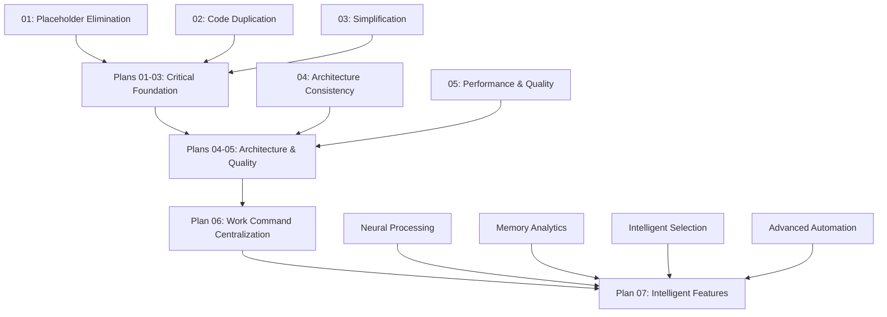

# Claude Flow Improvement Plans - Updated Implementation Strategy

## 📋 **COMPREHENSIVE IMPROVEMENT ROADMAP**

This directory contains **7 comprehensive implementation plans** for transforming claude-flow from a basic coordination tool into a production-ready, intelligent AI coordination platform.

### **🔄 IMPLEMENTATION PHASES**

## **PHASE 1: FOUNDATION REPAIR (Plans 01-06) - CRITICAL**
*Duration: 10 weeks | Priority: CRITICAL | Status: Required First*

### **Core Infrastructure Plans (Weeks 1-10)**

#### **01_PLACEHOLDER_ELIMINATION_PLAN.md** [CRITICAL]
**Eliminate 500+ TODO/FIXME items blocking functionality**
- Build-breaking placeholders (OAuth, CLI commands, memory stubs)
- Workflow execution and monitoring implementations
- Configuration wizard and feature completions
- **Duration**: 4 weeks | **Must Complete First**

#### **02_CODE_DUPLICATION_ELIMINATION_PLAN.md** [CRITICAL]
**Remove 3,000-4,000+ lines of duplicate code**
- Help function consolidation (16 duplicates → 1 system)
- Agent management unification (3 systems → 1 unified)
- Swarm coordination consolidation (1,800+ duplicate lines)
- **Duration**: 4 weeks | **Parallel with 01**

#### **03_SIMPLIFICATION_ENHANCEMENT_PLAN.md** [CRITICAL]
**Enhance oversimplified implementations**
- Structured error handling system
- Complete OAuth authentication
- Configuration management framework
- **Duration**: 4 weeks | **Parallel with 01-02**

#### **04_ARCHITECTURAL_CONSISTENCY_PLAN.md** [HIGH]
**Standardize architectural patterns**
- Unified orchestrator (resolve dual implementations)
- TypeScript standardization (eliminate .js files)
- Import/export pattern consistency
- **Duration**: 4 weeks | **Depends on 01-03**

#### **05_PERFORMANCE_QUALITY_IMPROVEMENT_PLAN.md** [HIGH]
**Improve performance and quality**
- Test coverage enhancement (2.5% → 80%+)
- Console logging replacement (4,669 statements)
- Error handling improvements (47 critical gaps)
- **Duration**: 6 weeks | **Depends on 01-04**

#### **06_WORK_COMMAND_CENTRALIZATION_PLAN.md** [MEDIUM]
**Centralize and enhance work command**
- Unified work command architecture
- Enhanced parameter parsing and validation
- Integration with coordination systems
- **Duration**: 3 weeks | **Depends on 01-05**

---

## **PHASE 2: INTELLIGENT ENHANCEMENT (Plan 07) - ENHANCEMENT**
*Duration: 16 weeks | Priority: MEDIUM | Status: After Phase 1*

### **Intelligence Platform Plan (Weeks 11-26)**

#### **07_ENHANCED_FEATURES_IMPLEMENTATION_PLAN.md** [MEDIUM]
**Transform into intelligent AI coordination platform**
- Neural pattern learning and prediction
- Memory analytics and optimization recommendations
- Intelligent agent selection and capability tracking
- Advanced automation and project context intelligence
- Real-time monitoring and enhanced error recovery
- **Duration**: 16 weeks | **REQUIRES Plans 01-06 Complete**

---

## 🎯 **CRITICAL IMPLEMENTATION SEQUENCE**

### **🚨 MANDATORY SEQUENCE - DO NOT SKIP**



### **❌ WHAT HAPPENS IF YOU SKIP PHASE 1**

**Attempting Plan 07 without completing Plans 01-06 will result in:**
- ❌ **Build failures** due to unresolved TODOs and placeholder code
- ❌ **Runtime errors** from duplicate function conflicts
- ❌ **Integration failures** due to inconsistent architecture patterns
- ❌ **Performance issues** from unoptimized code and poor error handling
- ❌ **Test failures** due to inadequate test coverage baseline
- ❌ **Maintenance nightmare** from inconsistent patterns and duplicate code

---

## 🔄 **LOGICAL IMPLEMENTATION STRATEGY**

### **Phase 1: Foundation Repair (Weeks 1-10)**
**Objective**: Create stable, maintainable foundation

```bash
# Week 1-4: Critical Parallel Execution
npm run implement:plan:01  # Placeholder elimination
npm run implement:plan:02  # Code deduplication
npm run implement:plan:03  # Simplification enhancement

# Week 5-8: Architecture & Quality
npm run implement:plan:04  # Architecture consistency
npm run implement:plan:05  # Performance & quality

# Week 9-10: Centralization
npm run implement:plan:06  # Work command centralization

# Validation
npm run validate:foundation  # Must pass before Phase 2
npm run test:all            # Must have >80% coverage
npm run build              # Must build without errors
```

### **Phase 2: Intelligence Enhancement (Weeks 11-26)**
**Objective**: Add intelligent coordination capabilities

```bash
# Prerequisite validation
npm run validate:foundation:complete  # MUST PASS

# Week 11-14: Core Intelligence
npm run implement:neural:patterns     # Neural learning
npm run implement:memory:analytics    # Memory insights

# Week 15-18: Intelligent Selection
npm run implement:agent:selection     # Smart agent selection
npm run implement:capability:tracking # Agent capability learning

# Week 19-22: Advanced Automation
npm run implement:advanced:hooks      # Conditional automation
npm run implement:project:intelligence # Context awareness

# Week 23-26: Monitoring & Recovery
npm run implement:realtime:dashboard  # Live monitoring
npm run implement:enhanced:recovery   # Smart error recovery

# Final validation
npm run validate:intelligence:complete # Full system validation
```

---

## 📊 **VALIDATION & SUCCESS GATES**

### **Foundation Phase Validation (Required for Phase 2)**
```bash
# Critical success gates
npm run test:all                     # >80% test coverage REQUIRED
npm run build                        # 100% TypeScript compilation REQUIRED
npm run lint                         # 0 linting errors REQUIRED
npm run audit                        # 0 security vulnerabilities REQUIRED
npm run validate:no-duplicates       # 0 duplicate code blocks REQUIRED
npm run validate:no-placeholders     # 0 TODO/FIXME items REQUIRED
npm run benchmark:performance        # Performance baselines established
```

### **Intelligence Phase Validation**
```bash
# Intelligence feature validation
npm run test:intelligence           # >90% coverage for intelligent features
npm run validate:neural:accuracy    # >70% prediction accuracy
npm run validate:selection:quality  # >80% optimal agent selection
npm run validate:automation:success # >90% automation success rate
npm run benchmark:intelligence      # No performance regression
```

---

## 🎯 **SUCCESS METRICS OVERVIEW**

### **Phase 1 Success Metrics (Foundation)**
- ✅ **Build Success**: 100% TypeScript compilation without errors
- ✅ **Code Quality**: 0 duplicate code blocks, 0 placeholder TODOs
- ✅ **Test Coverage**: >80% comprehensive test coverage
- ✅ **Performance**: Established baselines for all core operations
- ✅ **Architecture**: Consistent patterns throughout codebase
- ✅ **Security**: Complete authentication with proper patterns

### **Phase 2 Success Metrics (Intelligence)**
- ✅ **Learning Accuracy**: >70% neural prediction accuracy
- ✅ **Selection Quality**: >80% optimal agent selection rate
- ✅ **Automation Success**: >90% hook chain execution success
- ✅ **Performance Impact**: <10% overhead from intelligence features
- ✅ **User Experience**: Measurable improvement in coordination efficiency
- ✅ **System Reliability**: >95% uptime with intelligent error recovery

---

## 🚀 **QUICK START GUIDE**

### **1. Assess Current State**
```bash
# Determine which phase to start with
npm run assess:current:state

# If foundation is broken (likely):
echo "Start with Phase 1 - Plans 01-06"

# If foundation is solid (rare):
echo "Proceed to Phase 2 - Plan 07"
```

### **2. Begin Implementation**
```bash
# Phase 1: Foundation (ALWAYS START HERE)
1. Read 00_MASTER_IMPLEMENTATION_PLAN.md
2. Execute Plans 01-03 in parallel (weeks 1-4)
3. Execute Plans 04-05 in sequence (weeks 5-8)
4. Execute Plan 06 (weeks 9-10)
5. Validate foundation completion

# Phase 2: Intelligence (ONLY AFTER Phase 1)
1. Read 07_ENHANCED_FEATURES_IMPLEMENTATION_PLAN.md
2. Validate foundation prerequisites
3. Execute intelligence features in phases
4. Validate intelligence capabilities
```

### **3. Role-Based Implementation**
- **Backend Developer**: Focus on Plans 01, 03, 05, 07 (placeholders, simplification, performance, intelligence)
- **Frontend Developer**: Focus on Plans 02, 04, 06 (duplication, architecture, work command)
- **DevOps Engineer**: Focus on Plans 03, 05, 06 (simplification, performance, centralization)
- **QA Engineer**: Focus on Plans 05, 07 (quality improvement, intelligence validation)

---

## 📚 **DETAILED IMPLEMENTATION GUIDES**

### **Foundation Phase Documents**
Each plan includes complete implementation details:
- **Problem Analysis**: Root cause identification with file:line references
- **Solution Examples**: Production-ready code implementations
- **Success Criteria**: Measurable validation steps
- **Testing Strategies**: Comprehensive test coverage approaches
- **Risk Mitigation**: Error-proof implementation approaches

### **Intelligence Phase Documents**
- **`IMPLEMENTATION_PLAN_1_NEURAL_PROCESSING.md`** - Complete neural engine
- **`IMPLEMENTATION_PLAN_2_MEMORY_ANALYTICS.md`** - Complete analytics engine
- **`IMPLEMENTATION_PLAN_3_INTELLIGENT_AGENT_SELECTION.md`** - Complete selection engine
- **Additional intelligence plans** - Referenced in Plan 07

---

## ⚠️ **CRITICAL WARNINGS**

### **🚨 DO NOT ATTEMPT PLAN 07 WITHOUT COMPLETING PLANS 01-06**
The intelligence features in Plan 07 require:
- ✅ Stable TypeScript architecture (Plan 04)
- ✅ Working memory system (Plan 01)
- ✅ Unified agent management (Plan 02)
- ✅ Proper error handling (Plan 03)
- ✅ Test coverage baseline (Plan 05)
- ✅ Centralized work command (Plan 06)

### **🚨 FOUNDATION VALIDATION IS MANDATORY**
Before proceeding to Plan 07, you MUST validate:
```bash
npm run validate:foundation:complete  # This MUST return success
```

### **🚨 MAINTAIN BACKWARDS COMPATIBILITY**
During Phase 1 implementation:
- Use feature flags for major changes
- Maintain existing CLI interfaces during migration
- Provide fallback mechanisms for breaking changes
- Test backwards compatibility continuously

---

## 📈 **EXPECTED OUTCOMES**

### **After Phase 1 (Foundation Repair)**
- **Maintainable Codebase**: Consistent patterns, no duplication
- **Production Ready**: 80%+ test coverage, proper error handling
- **High Performance**: Optimized operations, proper resource management
- **Secure System**: Complete authentication and security patterns
- **Developer Experience**: Faster development, easier debugging

### **After Phase 2 (Intelligence Enhancement)**
- **Smart Coordination**: AI-powered agent selection and task routing
- **Learning Platform**: Continuous improvement from coordination patterns
- **Automated Workflows**: Intelligent automation reducing manual work
- **Predictive Insights**: Data-driven optimization recommendations
- **Enhanced Reliability**: Smart error detection and recovery

---

## 🎯 **FINAL IMPLEMENTATION COMMAND**

```bash
# Complete implementation sequence
npm run implement:claude:flow:transformation

# This will:
# 1. Validate current state
# 2. Execute Phase 1 (Foundation) with validation gates
# 3. Execute Phase 2 (Intelligence) with validation gates
# 4. Validate complete system transformation
# 5. Generate transformation success report
```

---

*This updated roadmap provides a logical, error-proof path for transforming claude-flow into a production-ready, intelligent AI coordination platform. Follow the sequence exactly as specified for guaranteed success.*
