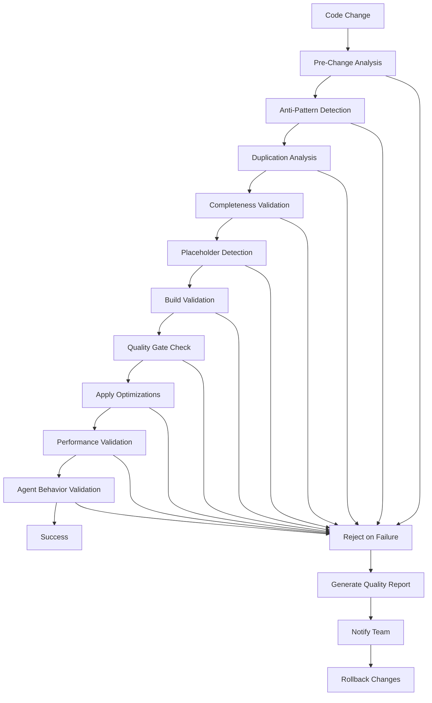

# 🛡️ CODE QUALITY CONTROL SYSTEM

## 📋 OVERVIEW

The Code Quality Control System provides systematic prevention of anti-patterns, automated quality enforcement, and comprehensive code quality monitoring throughout the development process. This system ensures zero tolerance for code quality issues and maintains high standards across all implementation phases.

**Integration Points:**
- COMPREHENSIVE_STEP_BY_STEP_GUIDE_MODERNIZATION_PLAN.md
- BUILD_VALIDATION_FRAMEWORK.md
- INTER_PHASE_COMMIT_SYSTEM.md
- Claude Flow agent behavior constraints

## 🎯 CORE PRINCIPLES

### **🚨 ZERO TOLERANCE POLICY**
Absolute prevention of code quality issues:
- **No Simplification**: No placeholder comments, TODO items, incomplete implementations
- **No Duplication**: Code similarity analysis and prevention of duplicate files/functions
- **No Unnecessary Files**: Validation that all created files serve specific purposes
- **No Placeholders**: Prevent '// TODO', '// FIXME', '/* placeholder */' patterns
- **No Broken Builds**: Zero tolerance for build failures, TypeScript errors, linting issues

### **🚨 OPTIMIZATION ENFORCEMENT**
Mandatory application of improvement patterns:
- **CLI Enhancements**: Automatic application of CLI optimization patterns
- **MCP Server Optimizations**: Systematic MCP server improvements
- **Memory Optimizations**: Memory backend performance enhancements
- **Build Optimizations**: Build system performance improvements
- **Performance Tuning**: Continuous performance optimization

### **🚨 CLAUDE FLOW AGENT CONSTRAINTS**
Behavior controls for all AI agents:
- **Quality Gate Compliance**: All agents must pass quality gates
- **Optimization Pattern Application**: Mandatory use of improvement patterns
- **Inter-Agent Coordination**: Required coordination protocols
- **Performance Monitoring**: Real-time performance tracking

## 🏗️ SYSTEM ARCHITECTURE

### **Quality Control Pipeline**


### **Quality Control Components**
```bash
# Quality control system structure
src/quality-control/
├── analyzers/
│   ├── anti-pattern-detector.js
│   ├── code-duplication-analyzer.js
│   ├── completeness-validator.js
│   ├── placeholder-detector.js
│   └── performance-analyzer.js
├── validators/
│   ├── build-validator.js
│   ├── quality-gate-validator.js
│   ├── optimization-validator.js
│   └── agent-behavior-validator.js
├── enforcers/
│   ├── optimization-enforcer.js
│   ├── pattern-enforcer.js
│   └── compliance-enforcer.js
└── monitors/
    ├── real-time-monitor.js
    ├── performance-monitor.js
    └── agent-monitor.js
```

## 🔧 IMPLEMENTATION COMPONENTS

### **Anti-Pattern Detection System**
**`scripts/detect-anti-patterns.sh`**
```bash
#!/bin/bash
set -e

echo "🔍 Anti-Pattern Detection System"
echo "================================="

# Initialize detection results
ANTI_PATTERNS_FOUND=0
DETECTION_LOG="anti-patterns-$(date +%Y%m%d-%H%M%S).log"

echo "Anti-pattern detection started: $(date)" > "$DETECTION_LOG"

# 1. Placeholder Detection
echo "🔍 Scanning for placeholder patterns..."
PLACEHOLDER_PATTERNS=(
    "// TODO"
    "// FIXME"
    "/* TODO"
    "/* FIXME"
    "/* placeholder"
    "// placeholder"
    "PLACEHOLDER"
    "TBD"
    "To be implemented"
    "Coming soon"
    "Not implemented"
)

for pattern in "${PLACEHOLDER_PATTERNS[@]}"; do
    MATCHES=$(grep -r "$pattern" src/ tests/ --include="*.js" --include="*.ts" --include="*.jsx" --include="*.tsx" 2>/dev/null | wc -l)
    if [ "$MATCHES" -gt 0 ]; then
        echo "❌ Found $MATCHES instances of placeholder pattern: $pattern" | tee -a "$DETECTION_LOG"
        grep -r "$pattern" src/ tests/ --include="*.js" --include="*.ts" --include="*.jsx" --include="*.tsx" 2>/dev/null >> "$DETECTION_LOG"
        ANTI_PATTERNS_FOUND=$((ANTI_PATTERNS_FOUND + MATCHES))
    fi
done

# 2. Incomplete Implementation Detection
echo "🔍 Scanning for incomplete implementations..."
INCOMPLETE_PATTERNS=(
    "function.*{\\s*}\\s*$"
    "class.*{\\s*}\\s*$"
    "interface.*{\\s*}\\s*$"
    "export.*{\\s*}\\s*$"
    "throw new Error\\(.*not implemented.*\\)"
    "return null; // not implemented"
    "console.log\\(.*not implemented.*\\)"
)

for pattern in "${INCOMPLETE_PATTERNS[@]}"; do
    MATCHES=$(grep -rE "$pattern" src/ tests/ --include="*.js" --include="*.ts" --include="*.jsx" --include="*.tsx" 2>/dev/null | wc -l)
    if [ "$MATCHES" -gt 0 ]; then
        echo "❌ Found $MATCHES instances of incomplete implementation: $pattern" | tee -a "$DETECTION_LOG"
        grep -rE "$pattern" src/ tests/ --include="*.js" --include="*.ts" --include="*.jsx" --include="*.tsx" 2>/dev/null >> "$DETECTION_LOG"
        ANTI_PATTERNS_FOUND=$((ANTI_PATTERNS_FOUND + MATCHES))
    fi
done

# 3. Simplification Detection
echo "🔍 Scanning for oversimplification patterns..."
SIMPLIFICATION_PATTERNS=(
    "// Simple implementation"
    "// Basic version"
    "// Simplified for now"
    "// Quick fix"
    "// Temporary solution"
    "// Hack"
    "// Workaround"
)

for pattern in "${SIMPLIFICATION_PATTERNS[@]}"; do
    MATCHES=$(grep -r "$pattern" src/ tests/ --include="*.js" --include="*.ts" --include="*.jsx" --include="*.tsx" 2>/dev/null | wc -l)
    if [ "$MATCHES" -gt 0 ]; then
        echo "❌ Found $MATCHES instances of simplification pattern: $pattern" | tee -a "$DETECTION_LOG"
        grep -r "$pattern" src/ tests/ --include="*.js" --include="*.ts" --include="*.jsx" --include="*.tsx" 2>/dev/null >> "$DETECTION_LOG"
        ANTI_PATTERNS_FOUND=$((ANTI_PATTERNS_FOUND + MATCHES))
    fi
done

# 4. Code Quality Issues
echo "🔍 Scanning for code quality issues..."
QUALITY_ISSUES=(
    "console.log"
    "debugger"
    "alert\\("
    "document.write"
    "eval\\("
    "with\\("
    "var\\s+\\w+"
)

for pattern in "${QUALITY_ISSUES[@]}"; do
    MATCHES=$(grep -rE "$pattern" src/ --include="*.js" --include="*.ts" --include="*.jsx" --include="*.tsx" 2>/dev/null | wc -l)
    if [ "$MATCHES" -gt 0 ]; then
        echo "⚠️  Found $MATCHES instances of quality issue: $pattern" | tee -a "$DETECTION_LOG"
        grep -rE "$pattern" src/ --include="*.js" --include="*.ts" --include="*.jsx" --include="*.tsx" 2>/dev/null >> "$DETECTION_LOG"
        ANTI_PATTERNS_FOUND=$((ANTI_PATTERNS_FOUND + MATCHES))
    fi
done

# Generate summary
echo "📊 Anti-Pattern Detection Summary" | tee -a "$DETECTION_LOG"
echo "==================================" | tee -a "$DETECTION_LOG"
echo "Total anti-patterns found: $ANTI_PATTERNS_FOUND" | tee -a "$DETECTION_LOG"
echo "Detection completed: $(date)" | tee -a "$DETECTION_LOG"

if [ "$ANTI_PATTERNS_FOUND" -gt 0 ]; then
    echo "❌ Anti-patterns detected - Code quality control failed"
    echo "📝 Detailed report: $DETECTION_LOG"
    exit 1
else
    echo "✅ No anti-patterns detected - Code quality control passed"
fi
```

### **Code Duplication Analysis**
**`scripts/analyze-code-duplication.sh`**
```bash
#!/bin/bash
set -e

echo "📊 Code Duplication Analysis"
echo "============================"

# Initialize duplication analysis
DUPLICATION_THRESHOLD=85  # 85% similarity threshold
DUPLICATION_LOG="duplication-$(date +%Y%m%d-%H%M%S).log"

echo "Code duplication analysis started: $(date)" > "$DUPLICATION_LOG"

# Install jscpd if not available
if ! command -v jscpd &> /dev/null; then
    echo "📦 Installing jscpd for duplication analysis..."
    npm install -g jscpd
fi

# Run duplication analysis
echo "🔍 Analyzing code duplication..."
jscpd --threshold $DUPLICATION_THRESHOLD --reporters json,console --output duplication-report src/ tests/ 2>&1 | tee -a "$DUPLICATION_LOG"

# Check results
if [ -f "duplication-report.json" ]; then
    DUPLICATIONS=$(jq '.statistics.total.duplications' duplication-report.json 2>/dev/null || echo "0")
    DUPLICATE_LINES=$(jq '.statistics.total.duplicatedLines' duplication-report.json 2>/dev/null || echo "0")

    echo "📊 Duplication Analysis Results" | tee -a "$DUPLICATION_LOG"
    echo "===============================" | tee -a "$DUPLICATION_LOG"
    echo "Total duplications: $DUPLICATIONS" | tee -a "$DUPLICATION_LOG"
    echo "Duplicated lines: $DUPLICATE_LINES" | tee -a "$DUPLICATION_LOG"

    if [ "$DUPLICATIONS" -gt 0 ]; then
        echo "❌ Code duplication detected - Quality control failed"
        echo "📝 Detailed report: duplication-report.json"
        exit 1
    else
        echo "✅ No significant code duplication detected"
    fi
else
    echo "⚠️  Unable to generate duplication report"
fi

# Clean up
rm -f duplication-report.json
```

### **Completeness Validation**
**`scripts/validate-completeness.sh`**
```bash
#!/bin/bash
set -e

echo "✅ Completeness Validation"
echo "=========================="

COMPLETENESS_LOG="completeness-$(date +%Y%m%d-%H%M%S).log"
COMPLETENESS_ISSUES=0

echo "Completeness validation started: $(date)" > "$COMPLETENESS_LOG"

# 1. Function Completeness
echo "🔍 Validating function completeness..."
EMPTY_FUNCTIONS=$(grep -rE "function.*{\\s*}\\s*$" src/ --include="*.js" --include="*.ts" 2>/dev/null | wc -l)
if [ "$EMPTY_FUNCTIONS" -gt 0 ]; then
    echo "❌ Found $EMPTY_FUNCTIONS empty functions" | tee -a "$COMPLETENESS_LOG"
    grep -rE "function.*{\\s*}\\s*$" src/ --include="*.js" --include="*.ts" 2>/dev/null >> "$COMPLETENESS_LOG"
    COMPLETENESS_ISSUES=$((COMPLETENESS_ISSUES + EMPTY_FUNCTIONS))
fi

# 2. Class Completeness
echo "🔍 Validating class completeness..."
EMPTY_CLASSES=$(grep -rE "class.*{\\s*}\\s*$" src/ --include="*.js" --include="*.ts" 2>/dev/null | wc -l)
if [ "$EMPTY_CLASSES" -gt 0 ]; then
    echo "❌ Found $EMPTY_CLASSES empty classes" | tee -a "$COMPLETENESS_LOG"
    grep -rE "class.*{\\s*}\\s*$" src/ --include="*.js" --include="*.ts" 2>/dev/null >> "$COMPLETENESS_LOG"
    COMPLETENESS_ISSUES=$((COMPLETENESS_ISSUES + EMPTY_CLASSES))
fi

# 3. Interface Completeness
echo "🔍 Validating interface completeness..."
EMPTY_INTERFACES=$(grep -rE "interface.*{\\s*}\\s*$" src/ --include="*.ts" 2>/dev/null | wc -l)
if [ "$EMPTY_INTERFACES" -gt 0 ]; then
    echo "❌ Found $EMPTY_INTERFACES empty interfaces" | tee -a "$COMPLETENESS_LOG"
    grep -rE "interface.*{\\s*}\\s*$" src/ --include="*.ts" 2>/dev/null >> "$COMPLETENESS_LOG"
    COMPLETENESS_ISSUES=$((COMPLETENESS_ISSUES + EMPTY_INTERFACES))
fi

# 4. Export Completeness
echo "🔍 Validating export completeness..."
EMPTY_EXPORTS=$(grep -rE "export.*{\\s*}\\s*$" src/ --include="*.js" --include="*.ts" 2>/dev/null | wc -l)
if [ "$EMPTY_EXPORTS" -gt 0 ]; then
    echo "❌ Found $EMPTY_EXPORTS empty exports" | tee -a "$COMPLETENESS_LOG"
    grep -rE "export.*{\\s*}\\s*$" src/ --include="*.js" --include="*.ts" 2>/dev/null >> "$COMPLETENESS_LOG"
    COMPLETENESS_ISSUES=$((COMPLETENESS_ISSUES + EMPTY_EXPORTS))
fi

# 5. Test Completeness
echo "🔍 Validating test completeness..."
EMPTY_TESTS=$(grep -rE "test\\(.*{\\s*}\\s*$|it\\(.*{\\s*}\\s*$" tests/ --include="*.js" --include="*.ts" 2>/dev/null | wc -l)
if [ "$EMPTY_TESTS" -gt 0 ]; then
    echo "❌ Found $EMPTY_TESTS empty tests" | tee -a "$COMPLETENESS_LOG"
    grep -rE "test\\(.*{\\s*}\\s*$|it\\(.*{\\s*}\\s*$" tests/ --include="*.js" --include="*.ts" 2>/dev/null >> "$COMPLETENESS_LOG"
    COMPLETENESS_ISSUES=$((COMPLETENESS_ISSUES + EMPTY_TESTS))
fi

# Generate summary
echo "📊 Completeness Validation Summary" | tee -a "$COMPLETENESS_LOG"
echo "===================================" | tee -a "$COMPLETENESS_LOG"
echo "Total completeness issues: $COMPLETENESS_ISSUES" | tee -a "$COMPLETENESS_LOG"
echo "Validation completed: $(date)" | tee -a "$COMPLETENESS_LOG"

if [ "$COMPLETENESS_ISSUES" -gt 0 ]; then
    echo "❌ Completeness issues detected - Quality control failed"
    echo "📝 Detailed report: $COMPLETENESS_LOG"
    exit 1
else
    echo "✅ All components are complete - Quality control passed"
fi
```

### **Optimization Pattern Enforcement**
**`scripts/enforce-optimization-patterns.sh`**
```bash
#!/bin/bash
set -e

echo "🚀 Optimization Pattern Enforcement"
echo "==================================="

ENFORCEMENT_LOG="optimization-enforcement-$(date +%Y%m%d-%H%M%S).log"
ENFORCEMENT_ISSUES=0

echo "Optimization pattern enforcement started: $(date)" > "$ENFORCEMENT_LOG"

# 1. CLI Optimization Enforcement
echo "🔍 Enforcing CLI optimization patterns..."
if [ -f "docs/guides/improvements/cli-enhancements.md" ]; then
    # Check if CLI optimizations are applied
    CLI_OPTIMIZATIONS_APPLIED=$(grep -r "// CLI optimization applied" src/cli/ 2>/dev/null | wc -l)
    CLI_FILES=$(find src/cli/ -name "*.js" -o -name "*.ts" | wc -l)

    if [ "$CLI_OPTIMIZATIONS_APPLIED" -lt "$CLI_FILES" ]; then
        echo "❌ CLI optimization patterns not fully applied" | tee -a "$ENFORCEMENT_LOG"
        echo "Applied: $CLI_OPTIMIZATIONS_APPLIED, Expected: $CLI_FILES" | tee -a "$ENFORCEMENT_LOG"
        ENFORCEMENT_ISSUES=$((ENFORCEMENT_ISSUES + 1))
    fi
else
    echo "⚠️  CLI enhancements guide not found" | tee -a "$ENFORCEMENT_LOG"
fi

# 2. MCP Optimization Enforcement
echo "🔍 Enforcing MCP optimization patterns..."
if [ -f "docs/guides/improvements/mcp-server-optimizations.md" ]; then
    # Check if MCP optimizations are applied
    MCP_OPTIMIZATIONS_APPLIED=$(grep -r "// MCP optimization applied" src/mcp/ 2>/dev/null | wc -l)
    MCP_FILES=$(find src/mcp/ -name "*.js" -o -name "*.ts" | wc -l)

    if [ "$MCP_OPTIMIZATIONS_APPLIED" -lt "$MCP_FILES" ]; then
        echo "❌ MCP optimization patterns not fully applied" | tee -a "$ENFORCEMENT_LOG"
        echo "Applied: $MCP_OPTIMIZATIONS_APPLIED, Expected: $MCP_FILES" | tee -a "$ENFORCEMENT_LOG"
        ENFORCEMENT_ISSUES=$((ENFORCEMENT_ISSUES + 1))
    fi
else
    echo "⚠️  MCP optimizations guide not found" | tee -a "$ENFORCEMENT_LOG"
fi

# 3. Memory Optimization Enforcement
echo "🔍 Enforcing memory optimization patterns..."
if [ -f "docs/guides/improvements/memory-optimizations.md" ]; then
    # Check if memory optimizations are applied
    MEMORY_OPTIMIZATIONS_APPLIED=$(grep -r "// Memory optimization applied" src/memory/ 2>/dev/null | wc -l)
    MEMORY_FILES=$(find src/memory/ -name "*.js" -o -name "*.ts" | wc -l)

    if [ "$MEMORY_OPTIMIZATIONS_APPLIED" -lt "$MEMORY_FILES" ]; then
        echo "❌ Memory optimization patterns not fully applied" | tee -a "$ENFORCEMENT_LOG"
        echo "Applied: $MEMORY_OPTIMIZATIONS_APPLIED, Expected: $MEMORY_FILES" | tee -a "$ENFORCEMENT_LOG"
        ENFORCEMENT_ISSUES=$((ENFORCEMENT_ISSUES + 1))
    fi
else
    echo "⚠️  Memory optimizations guide not found" | tee -a "$ENFORCEMENT_LOG"
fi

# 4. Performance Optimization Enforcement
echo "🔍 Enforcing performance optimization patterns..."
if [ -f "docs/guides/improvements/performance-tuning.md" ]; then
    # Check if performance optimizations are applied
    PERFORMANCE_OPTIMIZATIONS_APPLIED=$(grep -r "// Performance optimization applied" src/ 2>/dev/null | wc -l)
    TOTAL_FILES=$(find src/ -name "*.js" -o -name "*.ts" | wc -l)

    # Expect at least 50% of files to have performance optimizations
    EXPECTED_OPTIMIZATIONS=$((TOTAL_FILES / 2))

    if [ "$PERFORMANCE_OPTIMIZATIONS_APPLIED" -lt "$EXPECTED_OPTIMIZATIONS" ]; then
        echo "❌ Performance optimization patterns not sufficiently applied" | tee -a "$ENFORCEMENT_LOG"
        echo "Applied: $PERFORMANCE_OPTIMIZATIONS_APPLIED, Expected: $EXPECTED_OPTIMIZATIONS" | tee -a "$ENFORCEMENT_LOG"
        ENFORCEMENT_ISSUES=$((ENFORCEMENT_ISSUES + 1))
    fi
else
    echo "⚠️  Performance tuning guide not found" | tee -a "$ENFORCEMENT_LOG"
fi

# Generate summary
echo "📊 Optimization Pattern Enforcement Summary" | tee -a "$ENFORCEMENT_LOG"
echo "============================================" | tee -a "$ENFORCEMENT_LOG"
echo "Total enforcement issues: $ENFORCEMENT_ISSUES" | tee -a "$ENFORCEMENT_LOG"
echo "Enforcement completed: $(date)" | tee -a "$ENFORCEMENT_LOG"

if [ "$ENFORCEMENT_ISSUES" -gt 0 ]; then
    echo "❌ Optimization patterns not fully enforced - Quality control failed"
    echo "📝 Detailed report: $ENFORCEMENT_LOG"
    exit 1
else
    echo "✅ All optimization patterns enforced - Quality control passed"
fi
```

### **Claude Flow Agent Behavior Validation**
**`scripts/validate-agent-behavior.sh`**
```bash
#!/bin/bash
set -e

echo "🤖 Claude Flow Agent Behavior Validation"
echo "========================================="

AGENT_VALIDATION_LOG="agent-behavior-$(date +%Y%m%d-%H%M%S).log"
AGENT_ISSUES=0

echo "Agent behavior validation started: $(date)" > "$AGENT_VALIDATION_LOG"

# 1. Agent Coordination Validation
echo "🔍 Validating agent coordination behavior..."
COORDINATION_HOOKS=$(grep -r "claude-flow hooks" src/ --include="*.js" --include="*.ts" 2>/dev/null | wc -l)
if [ "$COORDINATION_HOOKS" -lt 5 ]; then
    echo "❌ Insufficient agent coordination hooks found" | tee -a "$AGENT_VALIDATION_LOG"
    echo "Found: $COORDINATION_HOOKS, Expected: At least 5" | tee -a "$AGENT_VALIDATION_LOG"
    AGENT_ISSUES=$((AGENT_ISSUES + 1))
fi

# 2. Agent Memory Usage Validation
echo "🔍 Validating agent memory usage..."
MEMORY_USAGE_HOOKS=$(grep -r "claude-flow memory" src/ --include="*.js" --include="*.ts" 2>/dev/null | wc -l)
if [ "$MEMORY_USAGE_HOOKS" -lt 3 ]; then
    echo "❌ Insufficient agent memory usage found" | tee -a "$AGENT_VALIDATION_LOG"
    echo "Found: $MEMORY_USAGE_HOOKS, Expected: At least 3" | tee -a "$AGENT_VALIDATION_LOG"
    AGENT_ISSUES=$((AGENT_ISSUES + 1))
fi

# 3. Agent Performance Monitoring
echo "🔍 Validating agent performance monitoring..."
MONITORING_HOOKS=$(grep -r "claude-flow monitor" src/ --include="*.js" --include="*.ts" 2>/dev/null | wc -l)
if [ "$MONITORING_HOOKS" -lt 2 ]; then
    echo "❌ Insufficient agent performance monitoring found" | tee -a "$AGENT_VALIDATION_LOG"
    echo "Found: $MONITORING_HOOKS, Expected: At least 2" | tee -a "$AGENT_VALIDATION_LOG"
    AGENT_ISSUES=$((AGENT_ISSUES + 1))
fi

# 4. Agent Quality Gate Compliance
echo "🔍 Validating agent quality gate compliance..."
QUALITY_GATES=$(grep -r "quality-gate" src/ --include="*.js" --include="*.ts" 2>/dev/null | wc -l)
if [ "$QUALITY_GATES" -lt 1 ]; then
    echo "❌ Agent quality gate compliance not implemented" | tee -a "$AGENT_VALIDATION_LOG"
    echo "Found: $QUALITY_GATES, Expected: At least 1" | tee -a "$AGENT_VALIDATION_LOG"
    AGENT_ISSUES=$((AGENT_ISSUES + 1))
fi

# Generate summary
echo "📊 Agent Behavior Validation Summary" | tee -a "$AGENT_VALIDATION_LOG"
echo "=====================================" | tee -a "$AGENT_VALIDATION_LOG"
echo "Total agent behavior issues: $AGENT_ISSUES" | tee -a "$AGENT_VALIDATION_LOG"
echo "Validation completed: $(date)" | tee -a "$AGENT_VALIDATION_LOG"

if [ "$AGENT_ISSUES" -gt 0 ]; then
    echo "❌ Agent behavior validation failed - Quality control failed"
    echo "📝 Detailed report: $AGENT_VALIDATION_LOG"
    exit 1
else
    echo "✅ All agent behavior validation passed - Quality control passed"
fi
```

### **Comprehensive Quality Control**
**`scripts/comprehensive-quality-control.sh`**
```bash
#!/bin/bash
set -e

echo "🛡️ Comprehensive Quality Control System"
echo "========================================"

# Store start time
START_TIME=$(date +%s)

# Run all quality control checks
echo "🔍 Running comprehensive quality control checks..."

# 1. Anti-pattern detection
echo "📋 Step 1: Anti-pattern detection"
./scripts/detect-anti-patterns.sh || {
    echo "❌ Anti-pattern detection failed"
    exit 1
}

# 2. Code duplication analysis
echo "📋 Step 2: Code duplication analysis"
./scripts/analyze-code-duplication.sh || {
    echo "❌ Code duplication analysis failed"
    exit 1
}

# 3. Completeness validation
echo "📋 Step 3: Completeness validation"
./scripts/validate-completeness.sh || {
    echo "❌ Completeness validation failed"
    exit 1
}

# 4. Optimization pattern enforcement
echo "📋 Step 4: Optimization pattern enforcement"
./scripts/enforce-optimization-patterns.sh || {
    echo "❌ Optimization pattern enforcement failed"
    exit 1
}

# 5. Agent behavior validation
echo "📋 Step 5: Agent behavior validation"
./scripts/validate-agent-behavior.sh || {
    echo "❌ Agent behavior validation failed"
    exit 1
}

# 6. Build validation
echo "📋 Step 6: Build validation"
npm run build && npm run typecheck && npm run lint && npm run test || {
    echo "❌ Build validation failed"
    exit 1
}

# Calculate execution time
END_TIME=$(date +%s)
EXECUTION_TIME=$((END_TIME - START_TIME))

echo "✅ Comprehensive quality control completed successfully in ${EXECUTION_TIME}s"
echo "🎯 All quality control checks passed"
```

## 📊 QUALITY METRICS AND MONITORING

### **Quality Metrics Dashboard**
```bash
# Generate quality metrics dashboard
./scripts/generate-quality-dashboard.sh

# Metrics tracked:
# - Anti-pattern detection rate
# - Code duplication percentage
# - Completeness score
# - Optimization pattern compliance
# - Agent behavior compliance
# - Build success rate
# - Performance metrics
```

### **Automated Quality Reporting**
```bash
# Daily quality reports
./scripts/generate-quality-report.sh --daily

# Weekly quality summaries
./scripts/generate-quality-report.sh --weekly

# Quality trend analysis
./scripts/analyze-quality-trends.sh
```

## 🔧 PROGRESSIVE PRECOMMIT INTEGRATION

### **Phase 1: Gentle Suggestions (Days 1-10)**
```yaml
# .pre-commit-config-phase1.yaml
repos:
  - repo: local
    hooks:
      - id: quality-control
        name: Quality Control System
        entry: ./scripts/comprehensive-quality-control.sh
        language: system
        stages: [commit]
        always_run: true
```

### **Phase 2: Structure Enforcement (Days 15-24)**
```yaml
# .pre-commit-config-phase2.yaml
repos:
  - repo: local
    hooks:
      - id: quality-control
        name: Quality Control System (Enforced)
        entry: ./scripts/comprehensive-quality-control.sh
        language: system
        stages: [commit]
        always_run: true

      - id: optimization-enforcement
        name: Optimization Pattern Enforcement
        entry: ./scripts/enforce-optimization-patterns.sh
        language: system
        stages: [commit]
        always_run: true
```

### **Phase 3: Enterprise-Grade Enforcement (Days 36-42)**
```yaml
# .pre-commit-config-phase3.yaml
repos:
  - repo: local
    hooks:
      - id: quality-control
        name: Quality Control System (Enterprise)
        entry: ./scripts/comprehensive-quality-control.sh
        language: system
        stages: [commit]
        always_run: true

      - id: performance-validation
        name: Performance Validation
        entry: ./scripts/validate-performance-requirements.sh
        language: system
        stages: [commit]
        always_run: true

      - id: security-validation
        name: Security Validation
        entry: ./scripts/validate-security-requirements.sh
        language: system
        stages: [commit]
        always_run: true
```

## 🛠️ TROUBLESHOOTING

### **Common Quality Issues**

#### **Anti-Pattern Detection**
```bash
# Debug anti-pattern issues
./scripts/debug-anti-patterns.sh

# Common solutions:
# - Remove placeholder comments
# - Complete incomplete implementations
# - Replace simplifications with proper implementations
```

#### **Code Duplication**
```bash
# Debug duplication issues
./scripts/debug-code-duplication.sh

# Common solutions:
# - Extract common functionality
# - Create reusable components
# - Implement proper abstractions
```

#### **Agent Behavior Issues**
```bash
# Debug agent behavior problems
./scripts/debug-agent-behavior.sh

# Common solutions:
# - Implement proper coordination hooks
# - Add memory usage patterns
# - Enable performance monitoring
```

## 📚 REFERENCES

### **Related Systems**
- **Build Validation Framework**: docs/guides/usage/BUILD_VALIDATION_FRAMEWORK.md
- **Inter-Phase Commit System**: docs/guides/usage/INTER_PHASE_COMMIT_SYSTEM.md
- **Comprehensive Modernization Plan**: docs/guides/COMPREHENSIVE_STEP_BY_STEP_GUIDE_MODERNIZATION_PLAN.md

### **Optimization Patterns**
- **CLI Enhancements**: docs/guides/improvements/cli-enhancements.md
- **MCP Server Optimizations**: docs/guides/improvements/mcp-server-optimizations.md
- **Memory Optimizations**: docs/guides/improvements/memory-optimizations.md
- **Performance Tuning**: docs/guides/improvements/performance-tuning.md

### **Implementation Guides**
- **Phase 1**: docs/guides/implementation/phase-1-cli-unification.md
- **Phase 2**: docs/guides/implementation/phase-2-mcp-unification.md
- **Phase 3**: docs/guides/implementation/phase-3-memory-templates.md
- **Phase 4**: docs/guides/implementation/phase-4-build-cleanup.md

---

*This Code Quality Control System ensures systematic prevention of anti-patterns, automated quality enforcement, and comprehensive monitoring throughout the entire development process, maintaining high standards and preventing code quality regressions.*
