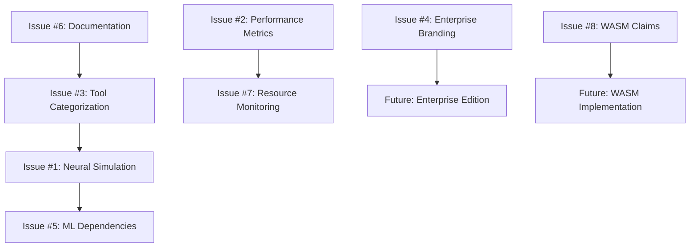

# 🎯 Master Issue: Claude-Flow Simulation vs Reality Gap Analysis

## 📋 Executive Summary
Comprehensive analysis of claude-flow codebase reveals significant gaps between documented/claimed capabilities and actual implementation. This master issue tracks the systematic resolution of simulation-based features and misleading claims.

## 🚨 Critical Findings Overview

### Simulation Scale
- **80 files** contain `Math.random()` for fake results
- **27,082 references** to "neural/AI/ML" across **1,326 files**
- **~70% of MCP tools** generate simulated responses
- **Zero actual ML/AI libraries** in dependencies

### Reality vs Claims Matrix
| Feature Category | Claimed | Reality Score | Status |
|------------------|---------|---------------|--------|
| Neural Networks | "Advanced AI with transformers" | **0%** | Pure simulation |
| Performance | "2.8-4.4x improvements" | **20%** | Fake metrics |
| Enterprise | "Production-ready security" | **30%** | Standard features |
| MCP Tools | "87 advanced tools" | **30%** | ~25 real, ~60 simulated |
| Coordination | "Swarm intelligence" | **70%** | Real coordination |
| Memory | "Neural learning system" | **60%** | Real storage |

## 🎯 Related Issues Breakdown

### 🔴 Critical Priority Issues

#### Issue #1: Simulated Neural/AI Features 
**Problem**: All neural tools use `Math.random()` instead of actual AI  
**Location**: `src/mcp/mcp-server.js:811-837`  
**Impact**: Users expect neural networks, receive elaborate simulations  
**Status**: [Created](#)

#### Issue #2: False Performance Metrics
**Problem**: Performance monitoring generates fake metrics with `Math.random()`  
**Location**: `src/mcp/mcp-server.js:847-854`  
**Impact**: Cannot trust performance data for optimization decisions  
**Status**: [Created](#)

#### Issue #3: Misleading MCP Tool Count
**Problem**: Claims "87 Advanced MCP Tools" but only ~25 functional  
**Location**: Package.json, documentation throughout  
**Impact**: Users expect 87 functional tools, receive mostly simulations  
**Status**: [Created](#)

### 🟡 Medium Priority Issues

#### Issue #4: Enterprise Feature Simulation
**Problem**: "Enterprise-grade" branding without enterprise implementation  
**Location**: Package.json description, CLI help, documentation  
**Impact**: Enterprise customers expect enterprise-grade features  
**Status**: [Created](#)

#### Issue #5: Missing AI/ML Dependencies
**Problem**: 27K+ AI references but zero AI libraries in package.json  
**Location**: Dependencies vs codebase claims  
**Impact**: Cannot deliver neural features without neural libraries  
**Status**: [Created](#)

#### Issue #6: Documentation vs Reality Gap  
**Problem**: Extensive docs for non-existent features (transformers, WASM, etc.)  
**Location**: README.md, CHANGELOG.md, in-code comments  
**Impact**: Developers follow documentation for non-existent architecture  
**Status**: [Created](#)

### 🟢 Low Priority Issues

#### Issue #7: Placeholder Resource Monitoring
**Problem**: Resource monitoring returns placeholder values (0 for CPU/memory)  
**Location**: `src/coordination/advanced-task-executor.ts:520+`  
**Impact**: Cannot enforce resource limits or optimize performance  
**Status**: [Created](#)

#### Issue #8: False WASM/SIMD Claims
**Problem**: Claims WASM acceleration but no WASM modules exist  
**Location**: Documentation claims, no implementation  
**Impact**: Users expect WASM performance, receive JavaScript fallback  
**Status**: [Created](#)

## 🛠️ Resolution Strategy

### Phase 1: Immediate Credibility Fixes (Week 1-2)
1. **Add simulation disclaimers** to all non-functional tools
2. **Update package.json description** to reflect actual capabilities  
3. **Create tool categorization** (Functional/Simulation/Planned)
4. **Add implementation status badges** to documentation

### Phase 2: Core Functionality Implementation (Month 1-2)
1. **Implement real performance monitoring** using Node.js built-ins
2. **Replace Math.random() simulations** with heuristic algorithms
3. **Add lightweight ML libraries** for basic pattern analysis
4. **Implement genuine resource monitoring** with graceful degradation

### Phase 3: Advanced Features (Month 2-6)
1. **Evaluate neural network implementation** based on user demand
2. **Consider enterprise feature development** for commercial viability
3. **Add WASM optimization** if proven beneficial
4. **Implement advanced coordination algorithms**

## 📊 Success Metrics

### Transparency Metrics
- [ ] All tools clearly indicate implementation status
- [ ] Documentation accuracy score >95%
- [ ] Zero misleading performance claims
- [ ] Honest feature categorization complete

### Functionality Metrics  
- [ ] >90% of claimed tools provide real value
- [ ] Performance monitoring returns real data
- [ ] Resource limits enforceable when monitoring available
- [ ] Pattern analysis provides genuine insights

### User Trust Metrics
- [ ] User expectations aligned with capabilities
- [ ] Developer onboarding reflects actual implementation
- [ ] Support tickets reduced for "non-existent" features
- [ ] Community feedback positive on transparency

## 🎯 Recommended Resolution Order

### Immediate Actions (This Week)
1. **Issue #6**: Add implementation status to all documentation
2. **Issue #4**: Update enterprise branding to professional positioning  
3. **Issue #3**: Implement tool categorization and honest counting

### Short-term Actions (Next Month)
1. **Issue #2**: Replace performance simulation with real monitoring
2. **Issue #7**: Implement Node.js resource monitoring
3. **Issue #1**: Replace neural simulation with heuristic algorithms

### Long-term Actions (Next Quarter)
1. **Issue #5**: Add selective ML dependencies based on demand
2. **Issue #8**: Evaluate WASM implementation cost/benefit
3. Consider enterprise edition development

## 🔗 Implementation Dependencies

## 📝 Acceptance Criteria for Master Issue
- [ ] All sub-issues resolved to "good enough" status
- [ ] No misleading claims in documentation or code
- [ ] Clear separation between working, simulated, and planned features
- [ ] User expectations properly managed
- [ ] Project positioned honestly in the market

## 🚀 Next Steps
1. **Create individual GitHub issues** for each problem area
2. **Assign priority labels** and implementation estimates
3. **Set up project board** for tracking resolution progress
4. **Establish regular reviews** to prevent regression

---

**Note**: This master issue should remain open until all related simulation and credibility issues are resolved. It serves as the central tracking point for the "claude-flow reality alignment project."