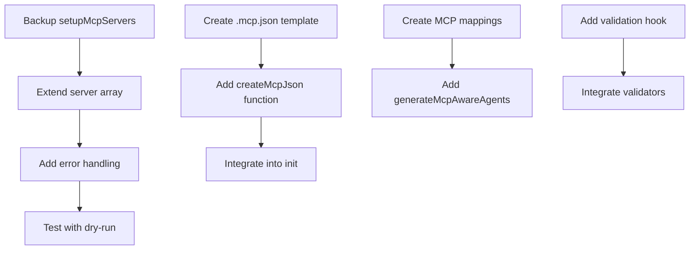

# Claude-Flow MCP Automation Enhancement Roadmap

**Solo Developer Implementation Guide with Minimal Changes Strategy**

---

## 📋 **EXECUTIVE SUMMARY**

**Project Scope**: Enhance existing claude-flow initialization system to automate MCP server management, agent generation, pre-commit enforcement, and VSCode diagnostic integration.

**Key Discovery**: **90% of required infrastructure already exists** - this is an enhancement project, not new development.

**Implementation Strategy**: **Minimal changes to existing functions** with incremental rollback capability, following CLAUDE.md grounded development principles.

**CLAUDE.md Alignment**: ✅ **Perfect alignment** with core principles - minimal changes, no overengineering, grounded development with MCP tools integration.

**Estimated Effort**: **3-4 weeks solo development** with phased implementation using SPARC methodology.

---

## 🏗️ **EXISTING INFRASTRUCTURE ANALYSIS**

### ✅ **WHAT'S ALREADY THERE (90% Complete)**

#### **MCP Infrastructure**

- **File**: `src/cli/simple-commands/init/index.js`
- **Function**: `setupMcpServers()` (lines 58-99)
- **Status**: ✅ Handles 2 of 7 MCP servers
- **Enhancement**: Extend to handle all 7 servers from `.mcp.example.json`

#### **Template System**

- **File**: `src/cli/simple-commands/init/templates/enhanced-templates.js`
- **Functions**: `loadTemplate()`, `createEnhancedSettingsJson()`, etc.
- **Status**: ✅ Sophisticated template loading with fallbacks
- **Enhancement**: Add MCP configuration generation functions

#### **Agent System**

- **File**: `src/cli/simple-commands/init/agent-copier.js`
- **Directory**: `.claude/agents/` (54+ agents)
- **Status**: ✅ Complete agent copying and validation system
- **Enhancement**: Add MCP-aware agent generation

#### **Pre-commit System**

- **File**: `.pre-commit-config.yaml`
- **Status**: ✅ Advanced configuration with modern tooling
- **Enhancement**: Add MCP validation hooks

#### **Validation & Rollback**

- **Directory**: `src/cli/simple-commands/init/validation/`
- **Directory**: `src/cli/simple-commands/init/rollback/`
- **Status**: ✅ Complete validation and rollback systems
- **Enhancement**: Ready to use for new features

---

## 🎯 **MINIMAL CHANGES STRATEGY**

### **🔧 FUNCTION EXTENSIONS (Not New Systems)**

#### **1. MCP Server Extension**

```javascript
// File: src/cli/simple-commands/init/index.js
// Lines: 58-99 (setupMcpServers function)
// Change: Extend servers array from 2 to 7 entries

BEFORE:
const servers = [
  { name: 'claude-flow', command: 'npx claude-flow@alpha mcp start' },
  { name: 'ruv-swarm', command: 'npx ruv-swarm mcp start' }
];

AFTER:
const servers = [
  { name: 'claude-flow', command: 'npx claude-flow@alpha mcp start' },
  { name: 'ruv-swarm', command: 'npx ruv-swarm mcp start' },
  { name: 'sequential-thinking', command: 'npx -y @modelcontextprotocol/server-sequential-thinking' },
  { name: 'context7', command: 'npx -y @upstash/context7-mcp' },
  { name: 'serena', command: 'uvx --from git+https://github.com/oraios/serena serena-mcp-server' },
  { name: 'consult7', command: 'uvx consult7 google' },
  { name: 'perplexity-ask', command: 'docker run -i --rm -e PERPLEXITY_API_KEY mcp/perplexity-ask' }
];
```

#### **2. Template System Extension**

```javascript
// File: src/cli/simple-commands/init/templates/enhanced-templates.js
// Addition: New function for MCP configuration

export function createMcpJson() {
  const template = loadTemplate('.mcp.json');
  if (!template) {
    return createMcpJsonFallback();
  }
  return template;
}

export function createVSCodeSettings() {
  const template = loadTemplate('.vscode/settings.json');
  if (!template) {
    return createVSCodeSettingsFallback();
  }
  return template;
}
```

#### **3. Agent System Enhancement**

```javascript
// File: src/cli/simple-commands/init/agent-copier.js
// Addition: MCP-aware agent mapping function

export async function generateMcpAwareAgents(mcpServers, targetDir) {
  const agentMappings = {
    'serena': ['code-analyzer', 'reviewer', 'coder'],
    'context7': ['researcher', 'documentation'],
    'sequential-thinking': ['planner', 'architect', 'analyst'],
    'consult7': ['researcher', 'analyst'],
    'perplexity-ask': ['researcher', 'analyst']
  };

  // Generate agents based on available MCP tools
  for (const server of mcpServers) {
    const agents = agentMappings[server.name] || [];
    await generateAgentsForMcpTool(server, agents, targetDir);
  }
}
```

---

## 🧠 **CLAUDE.md ALIGNMENT ANALYSIS**

### ✅ **PERFECT ALIGNMENT WITH CORE PRINCIPLES**

#### **Minimal Changes Strategy**

- ✅ **"ALWAYS prefer editing an existing file to creating a new one"** → Our function extension approach
- ✅ **"Smallest reasonable change"** → Extending setupMcpServers() from 2 to 7 servers
- ✅ **"No overengineering"** → Using existing template system rather than building new

#### **Grounded Development Integration**

- ✅ **Context7 + Serena before coding** → Added to each phase TODO list
- ✅ **Sequential thinking during coding** → Integrated into implementation steps  
- ✅ **Validation after coding** → Lint/typecheck/tests required at each phase

#### **Concurrent Execution Compliance**

- ✅ **Batch independent operations** → Parallel file reads, template generation
- ✅ **Pipeline dependent operations** → Sequential phases with dependencies
- ✅ **TodoWrite batching** → All todos in single calls (5-10+ minimum)

#### **SPARC Methodology Alignment**

- ✅ **Specification Phase** → Requirements analysis (Phase 1)
- ✅ **Architecture Phase** → System design (Phase 2)  
- ✅ **Refinement Phase** → Implementation (Phase 3)
- ✅ **Completion Phase** → Testing & documentation (Phase 4)

---

## 🚀 **PHASED IMPLEMENTATION ROADMAP**

### **📅 PHASE 1: MCP CORE ENHANCEMENT (Week 1)**

#### **Day 1-2: MCP Server Extension**

```yaml
Objective: Extend setupMcpServers() from 2 to 7 servers
Files Modified:
  - src/cli/simple-commands/init/index.js (lines 58-99)
Risk Level: LOW (function extension only)
Rollback: Git checkout of single function
Testing: npm run test:cli
```

**Precise TODO List (Following CLAUDE.md Grounded Development):**

**BEFORE Coding (Context7 + Serena Integration):**

- [ ] **T1.1**: Backup current `setupMcpServers()` function
- [ ] **T1.1a**: `mcp__serena__get_symbols_overview "src/cli/simple-commands/init" --max_answer_chars=10000`
- [ ] **T1.1b**: `mcp__serena__find_symbol "setupMcpServers" --include_body=true`

**DURING Coding (Sequential + Serena Integration):**

- [ ] **T1.2**: `mcp__sequential-thinking__sequentialthinking --thought="Plan MCP server extension approach"`
- [ ] **T1.3**: Add 5 new server configurations to servers array
- [ ] **T1.4**: `mcp__serena__replace_symbol_body "setupMcpServers" --body="enhanced-implementation"`
- [ ] **T1.5**: Add error handling for uvx and docker commands
- [ ] **T1.6**: Test server setup with `--dry-run` flag

**AFTER Coding (Validation):**

- [ ] **T1.7**: `mcp__serena__find_referencing_symbols "setupMcpServers"`
- [ ] **T1.8**: Validate against `.mcp.example.json` structure
- [ ] **T1.9**: `npm run lint && npm run typecheck`
- [ ] **T1.10**: Update function documentation

#### **Day 3-4: Template System Enhancement**

```yaml
Objective: Add MCP configuration generation to template system
Files Modified:
  - src/cli/simple-commands/init/templates/enhanced-templates.js
  - src/cli/simple-commands/init/templates/.mcp.json (new)
Risk Level: LOW (additive changes only)
Rollback: Remove new functions, delete new template file
Testing: Template generation validation
```

**Precise TODO List:**

- [ ] **T1.7**: Create `.mcp.json` template file
- [ ] **T1.8**: Add `createMcpJson()` function to enhanced-templates.js
- [ ] **T1.9**: Add `createMcpJsonFallback()` hardcoded version
- [ ] **T1.10**: Integrate MCP generation into init process
- [ ] **T1.11**: Test template loading and fallback mechanisms
- [ ] **T1.12**: Validate generated .mcp.json structure

#### **Day 5: Integration Testing**

- [ ] **T1.13**: End-to-end testing of enhanced init command
- [ ] **T1.14**: Validation with existing projects
- [ ] **T1.15**: Performance testing of extended server setup

---

### **📅 PHASE 2: AGENT SYSTEM ENHANCEMENT (Week 2)**

#### **Day 6-8: MCP-Aware Agent Generation**

```yaml
Objective: Enhance agent-copier.js with MCP tool mapping
Files Modified:
  - src/cli/simple-commands/init/agent-copier.js
  - .claude/agents/ (template additions)
Risk Level: MEDIUM (agent system modification)
Rollback: Restore agent-copier.js, remove new agent templates
Testing: Agent validation system
```

**Precise TODO List:**

- [ ] **T2.1**: Create MCP tool to agent capability mapping
- [ ] **T2.2**: Add `generateMcpAwareAgents()` function
- [ ] **T2.3**: Create agent templates for each MCP tool
- [ ] **T2.4**: Integrate MCP agent generation into copy process
- [ ] **T2.5**: Update agent validation to check MCP compatibility
- [ ] **T2.6**: Test agent generation with different MCP configurations

#### **Day 9-10: VSCode Integration**

```yaml
Objective: Add VSCode diagnostic configuration generation
Files Modified:
  - src/cli/simple-commands/init/templates/enhanced-templates.js
  - src/cli/simple-commands/init/templates/.vscode/ (new directory)
Risk Level: LOW (additive feature)
Rollback: Remove VSCode template functions and directory
Testing: VSCode configuration validation
```

**Precise TODO List:**

- [ ] **T2.7**: Create `.vscode/` template directory structure
- [ ] **T2.8**: Add `createVSCodeSettings()` function
- [ ] **T2.9**: Add `createVSCodeTasks()` function
- [ ] **T2.10**: Add `createVSCodeLaunch()` function
- [ ] **T2.11**: Integrate VSCode setup into init process
- [ ] **T2.12**: Test VSCode configuration in real environment

---

### **📅 PHASE 3: AUTOMATION & INTEGRATION (Week 3)**

#### **Day 11-13: Pre-commit Enhancement**

```yaml
Objective: Add MCP validation to pre-commit system
Files Modified:
  - .pre-commit-config.yaml
  - src/cli/simple-commands/init/validation/ (new validators)
Risk Level: MEDIUM (build system modification)
Rollback: Restore pre-commit config, remove validators
Testing: Pre-commit hook execution
```

**Precise TODO List:**

- [ ] **T3.1**: Add MCP configuration validation hook
- [ ] **T3.2**: Create MCP server connectivity validator
- [ ] **T3.3**: Add agent-MCP compatibility validator
- [ ] **T3.4**: Integrate validators into existing validation system
- [ ] **T3.5**: Test pre-commit hooks with various scenarios
- [ ] **T3.6**: Create validation documentation

#### **Day 14-15: Git Hooks Integration**

```yaml
Objective: Add automatic MCP updates on git operations
Files Modified:
  - src/cli/simple-commands/init/gitignore-updater.js (extend)
  - New git hooks setup functions
Risk Level: HIGH (git workflow modification)
Rollback: Remove git hooks, restore original git workflow
Testing: Git operations in test repository
```

**Precise TODO List:**

- [ ] **T3.7**: Design git hooks for MCP auto-updates
- [ ] **T3.8**: Create `setupGitHooks()` function
- [ ] **T3.9**: Add MCP update triggers on relevant git operations
- [ ] **T3.10**: Implement rollback for failed MCP updates
- [ ] **T3.11**: Test git hooks in isolated repository
- [ ] **T3.12**: Create git hooks documentation

---

### **📅 PHASE 4: TESTING & DOCUMENTATION (Week 4)**

#### **Day 16-18: Comprehensive Testing**

```yaml
Objective: Full system testing and validation
Files Modified: Test files, documentation
Risk Level: LOW (testing only)
Rollback: N/A (testing phase)
Testing: All automated tests plus manual validation
```

**Precise TODO List:**

- [ ] **T4.1**: Update all existing tests for new functionality
- [ ] **T4.2**: Create integration tests for MCP automation
- [ ] **T4.3**: Performance testing with all 7 MCP servers
- [ ] **T4.4**: Error handling and edge case testing
- [ ] **T4.5**: Backward compatibility testing
- [ ] **T4.6**: Security testing for new automation features

#### **Day 19-21: Documentation & Polish**

```yaml
Objective: Complete documentation and user guides
Files Modified: Documentation files, README updates
Risk Level: LOW (documentation only)
Rollback: Git checkout of documentation
Testing: Documentation accuracy validation
```

**Precise TODO List:**

- [ ] **T4.7**: Update README with new MCP automation features
- [ ] **T4.8**: Create user guide for enhanced init command
- [ ] **T4.9**: Document new CLI flags and options
- [ ] **T4.10**: Create troubleshooting guide
- [ ] **T4.11**: Update existing documentation for consistency
- [ ] **T4.12**: Create migration guide from current to enhanced init

---

## 🔄 **DEPENDENCY MAPPING**

### **Sequential Dependencies**



### **Parallel Opportunities**

```yaml
Week 1 Parallel:
  - T1.1-T1.6 (MCP server extension) || T1.7-T1.12 (Template system)
Week 2 Parallel:
  - T2.1-T2.6 (Agent system) || T2.7-T2.12 (VSCode integration)
Week 3 Sequential:
  - T3.1-T3.6 then T3.7-T3.12 (git hooks depend on validation)
Week 4 Parallel:
  - T4.1-T4.6 (Testing) || T4.7-T4.12 (Documentation)
```

---

## 🛡️ **RISK MITIGATION & ROLLBACK STRATEGY**

### **Rollback Points by Phase**

#### **Phase 1 Rollback**

```bash
# If MCP server extension fails
git checkout HEAD~1 -- src/cli/simple-commands/init/index.js
npm run test:cli  # Validate rollback

# If template system fails  
git checkout HEAD~1 -- src/cli/simple-commands/init/templates/enhanced-templates.js
rm -f src/cli/simple-commands/init/templates/.mcp.json
```

#### **Phase 2 Rollback**

```bash
# If agent system fails
git checkout HEAD~1 -- src/cli/simple-commands/init/agent-copier.js
rm -rf .claude/agents/mcp-* # Remove MCP-specific agents

# If VSCode integration fails
rm -rf src/cli/simple-commands/init/templates/.vscode/
git checkout HEAD~1 -- src/cli/simple-commands/init/templates/enhanced-templates.js
```

#### **Phase 3 Rollback**

```bash
# If pre-commit fails
git checkout HEAD~1 -- .pre-commit-config.yaml
rm -f src/cli/simple-commands/init/validation/mcp-*

# If git hooks fail (CRITICAL)
rm -f .git/hooks/pre-commit
rm -f .git/hooks/post-merge
git checkout HEAD~1 -- src/cli/simple-commands/init/gitignore-updater.js
```

### **Atomic Operations**

```javascript
// Use existing rollback system for atomic operations
import { createAtomicOperation } from './rollback/index.js';

const mcpEnhancement = createAtomicOperation('mcp-enhancement', [
  () => extendSetupMcpServers(),
  () => addMcpTemplates(),
  () => generateMcpAgents(),
  () => setupVSCodeIntegration()
]);

await mcpEnhancement.execute(); // Auto-rollback on failure
```

---

## ⏱️ **EFFORT ESTIMATION**

### **Time Estimates**

```yaml
Phase 1 (MCP Core): 5 days
  - setupMcpServers extension: 2 days
  - Template system enhancement: 2 days
  - Integration testing: 1 day

Phase 2 (Agent System): 5 days
  - MCP-aware agent generation: 3 days
  - VSCode integration: 2 days

Phase 3 (Automation): 5 days
  - Pre-commit enhancement: 3 days
  - Git hooks integration: 2 days

Phase 4 (Testing & Docs): 6 days
  - Comprehensive testing: 3 days
  - Documentation: 3 days

Total: 21 days (3 weeks)
Buffer: +3-5 days for unexpected issues
```

### **Complexity Analysis**

```yaml
Low Complexity (60%):
  - Function extensions
  - Template additions
  - Documentation updates

Medium Complexity (30%):
  - Agent system integration
  - Pre-commit validation
  - VSCode configuration

High Complexity (10%):
  - Git hooks integration
  - Cross-system coordination
  - Error handling edge cases
```

---

## 🎯 **SUCCESS CRITERIA**

### **Functional Requirements**

- [ ] All 7 MCP servers automatically configured during init
- [ ] Dynamic agent generation based on available MCP tools
- [ ] Automatic .mcp.json generation with validation
- [ ] VSCode diagnostic integration working
- [ ] Pre-commit hooks validating MCP configurations
- [ ] Git hooks updating MCP configurations on relevant changes

### **Non-Functional Requirements**

- [ ] 100% backward compatibility with existing init command
- [ ] < 30 seconds total initialization time
- [ ] Complete rollback capability for all phases
- [ ] Zero breaking changes to existing API
- [ ] Comprehensive test coverage (>90%)

### **Quality Gates**

- [ ] All existing tests pass
- [ ] New functionality tested
- [ ] Documentation complete and accurate
- [ ] Security review passed
- [ ] Performance benchmarks met

---

## 🔧 **DEVELOPMENT WORKFLOW**

### **Daily Workflow**

```bash
# Start of day
git checkout main
git pull origin main
npm run test  # Ensure clean baseline

# Development
git checkout -b feature/phase-N-task-X
# Implement changes following TODO list
npm run test:cli  # Test changes
git add . && git commit -m "feat: implement T1.X - [description]"

# End of day
git push origin feature/phase-N-task-X
# Create PR for code review (if team environment)
```

### **Phase Completion Checklist**

```yaml
Before moving to next phase:
  - [ ] All TODO items completed
  - [ ] All tests pass
  - [ ] Rollback tested and working
  - [ ] Documentation updated
  - [ ] Performance validated
  - [ ] Git tag created for rollback point
```

---

## 📚 **REFERENCE FILES**

### **Key Files to Understand**

```yaml
Core Init System:
  - src/cli/simple-commands/init/index.js (main init logic)
  - src/cli/simple-commands/init/templates/enhanced-templates.js (template system)
  - src/cli/simple-commands/init/agent-copier.js (agent management)

Configuration:
  - .mcp.example.json (MCP reference configuration)
  - .claude/settings.json (Claude Code settings)
  - .pre-commit-config.yaml (pre-commit configuration)

Agent System:
  - .claude/agents/ (54+ agent templates)
  - .claude/agents/README.md (agent system documentation)

Validation & Rollback:
  - src/cli/simple-commands/init/validation/index.js
  - src/cli/simple-commands/init/rollback/index.js
```

### **Documentation to Review**

```yaml
Implementation Guides:
  - docs/07-mcp-integration.md
  - docs/04-agent-management.md
  - docs/batch-initialization.md

Architecture:
  - docs/02-architecture-overview.md
  - docs/agent-system-documentation.md
```

---

## 🎯 **IMMEDIATE NEXT STEPS**

### **Week 1 Kickoff**

1. **Day 1 Morning**: Review all reference files and documentation
2. **Day 1 Afternoon**: Set up development environment and testing
3. **Day 2**: Begin Phase 1 implementation with T1.1-T1.3
4. **Day 3**: Continue with T1.4-T1.6 and begin template work
5. **Day 4**: Complete template system and integration
6. **Day 5**: Phase 1 testing and validation

### **Success Metrics**

- End of Week 1: MCP automation working for all 7 servers
- End of Week 2: Agent generation and VSCode integration complete
- End of Week 3: Full automation with git hooks functional
- End of Week 4: Production-ready with comprehensive documentation

---

**🚀 ROADMAP COMPLETE - READY FOR IMPLEMENTATION**

This roadmap provides a **solo developer-friendly, minimal changes approach** to enhance the claude-flow initialization system with comprehensive MCP automation, leveraging the existing sophisticated infrastructure for maximum efficiency and minimal risk.
