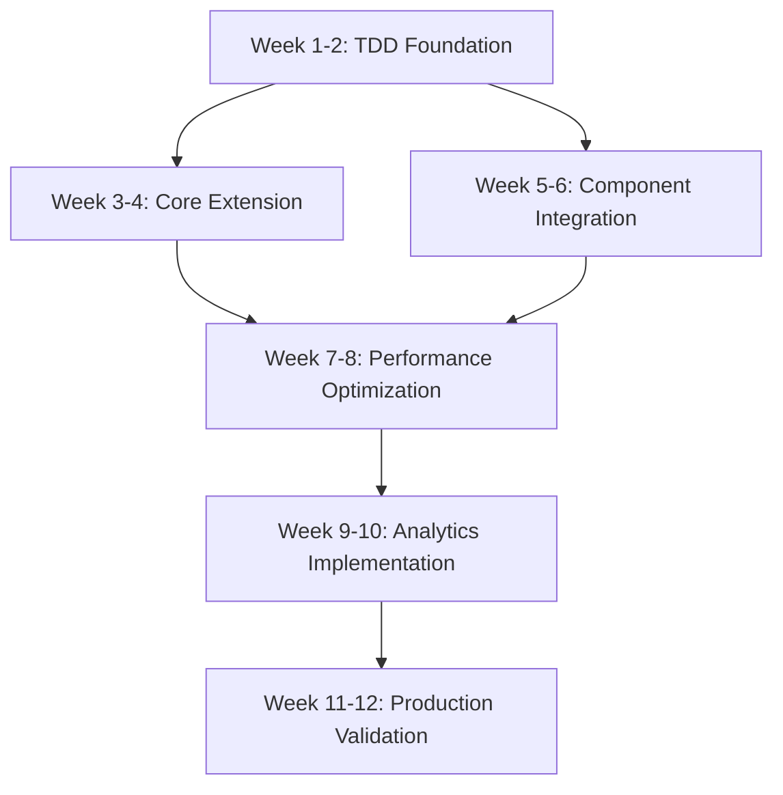

# Plan – IMPL – 2025-08-01

## Debug Logging Implementation for Claude-Flow Refactor Preparation

### 1. State Snapshot

#### **System State Analysis (CRITICAL)**

- **Memory Pressure**: 98.96% utilization (25.5GB/25.8GB) - EXTREME CONSTRAINT
- **Project**: claude-flow v2.0.0-alpha.79 - Enterprise AI orchestration monorepo
- **Technical Debt**: 4,230+ console.* calls across 89 TypeScript files requiring replacement
- **Foundation**: Solid ILogger interface in `src/core/logger.ts` with enterprise features
- **Architecture**: 333+ files across 9 major subsystems requiring systematic debug integration

#### **Hive Mind Collective Analysis Results**

- **Requirements Analyst**: Identified 9 subsystems, performance constraints, migration scope  
- **Codebase Analyst**: Mapped dependencies, component priorities, integration points
- **TDD Strategist**: Comprehensive test-first approach with memory-aware validation
- **Architecture Researcher**: Memory-efficient patterns, correlation tracking, MCP compliance

#### **CLAUDE.md Alignment Verification**

✅ **Minimal Changes**: Extend existing ILogger vs. complete rewrite  
✅ **Grounded Development**: MCP tools (Context7, Serena, Sequential-thinking) integration planned  
✅ **Concurrent Execution**: BatchTool patterns for parallel implementation  
✅ **No Overengineering**: Build on existing infrastructure, avoid complex abstractions

#### **ROADMAP.md Context Integration**

- **90% Infrastructure Exists**: MCP automation enhancement roadmap aligns with debug logging
- **Template System Ready**: Existing validation/rollback systems support debug integration
- **Agent System Prepared**: 54+ agents ready for MCP-aware debug correlation

### 2. Objectives & Acceptance Criteria

#### **Primary Objective**

Implement memory-efficient debug logging infrastructure enabling systematic identification of unused legacy files, duplicate code patterns, and architectural debt while maintaining <50MB memory footprint and <5% performance overhead in critical memory environment.

#### **Acceptance Criteria (IMPL Phase)**

**AC-1: TDD Implementation Foundation**

- [ ] Test-first development with >95% coverage for debug infrastructure
- [ ] Memory-constrained testing at 98%+ system utilization
- [ ] Performance regression testing with <5%/<10% overhead validation
- [ ] MCP protocol compliance testing with stderr-only debug output

**AC-2: Memory-Optimized Debug Infrastructure**

- [ ] Extended IDebugLogger interface with component-specific capabilities
- [ ] Circular buffer system with adaptive sizing (10K entries ≈ 2MB base)
- [ ] Zero-allocation patterns for hot paths using object pooling
- [ ] Emergency circuit breaker at 95% memory threshold

**AC-3: Component Integration (9 Subsystems)**

- [ ] CLI subsystem (50+ files, ~1,500 console calls) - HIGH priority
- [ ] MCP subsystem (15+ files, ~800 console calls) - CRITICAL priority  
- [ ] Swarm coordination (20+ files, ~1,200 console calls) - HIGH priority
- [ ] Core infrastructure (12+ files, ~600 console calls) - CRITICAL priority
- [ ] Memory/Terminal/Migration/Hooks/Enterprise (remaining ~1,130 console calls)

**AC-4: Refactor Preparation Analytics**

- [ ] Function call tracking with 95%+ accuracy for dead code identification
- [ ] Cross-component dependency mapping for safe refactoring
- [ ] Legacy pattern detection and consolidation recommendations
- [ ] Migration progress tracking with rollback capabilities

**AC-5: Production Readiness**

- [ ] Complete migration of 4,230+ console calls without functionality loss
- [ ] External log aggregation compatibility (ELK, Splunk, DataDog)
- [ ] Cross-system correlation with claude-code via correlation IDs
- [ ] Comprehensive monitoring and alerting integration

### 3. Task DAG

#### **Implementation Timeline: 12 weeks (TDD-focused)**



#### **Detailed Task Breakdown**

| TaskID | Summary | Owner Agent | Duration | Dependencies | Phase | Parallelizable | Exit Criteria |
|--------|---------|-------------|----------|--------------|-------|----------------|---------------|
| **FOUNDATION PHASE** |
| T1.1 | TDD setup: memory-constrained test environment | tester | 3 days | None | Foundation | No | Memory simulation at 98%+ working |
| T1.2 | Core IDebugLogger interface design & tests | system-architect | 4 days | T1.1 | Foundation | No | Interface tests passing |
| T1.3 | Circular buffer & memory management tests | perf-analyzer | 5 days | T1.1 | Foundation | Yes | <50MB footprint validated |
| T1.4 | Correlation ID system TDD implementation | backend-dev | 4 days | T1.2 | Foundation | Yes | Cross-component tracking working |
| **INTEGRATION PHASE** |
| T2.1 | CLI subsystem debug integration (50+ files) | coder | 8 days | T1.2,T1.4 | Integration | Partial | All CLI commands debug-enabled |
| T2.2 | MCP protocol debug compliance implementation | backend-dev | 6 days | T1.2,T1.4 | Integration | Yes | Stderr-only debug output validated |
| T2.3 | Swarm coordination debug integration | coder | 7 days | T1.2,T1.4 | Integration | Yes | Agent lifecycle debugging functional |
| T2.4 | Core/Memory/Terminal subsystem integration | coder | 6 days | T1.2,T1.4 | Integration | Yes | Core infrastructure debug-enabled |
| **OPTIMIZATION PHASE** |
| T3.1 | Performance optimization under memory pressure | perf-analyzer | 8 days | T2.1,T2.2,T2.3,T2.4 | Optimization | No | <5%/<10% overhead achieved |
| T3.2 | Console.* migration tooling & validation | coder | 5 days | T2.1,T2.2,T2.3,T2.4 | Optimization | Yes | 4,230+ calls migrated |
| T3.3 | Dead code analytics implementation | analyst | 6 days | T3.2 | Optimization | Yes | Usage tracking functional |
| **VALIDATION PHASE** |
| T4.1 | End-to-end testing & performance validation | tester | 6 days | T3.1,T3.2,T3.3 | Validation | Partial | All acceptance criteria met |
| T4.2 | Production rollout & monitoring integration | reviewer | 4 days | T4.1 | Validation | No | Production-ready with monitoring |

#### **Parallel Execution Opportunities**

- **Week 1-2**: T1.1 → (T1.3 || T1.4) - Memory tests parallel with correlation system
- **Week 3-4**: T2.2 || T2.3 || T2.4 - MCP, Swarm, Core integration concurrent  
- **Week 5-6**: T3.2 || T3.3 - Migration tooling parallel with analytics
- **Week 7-8**: Partial T4.1 - Integration testing parallel with optimization

### 4. Design & Constraints (Tooling Profile)

#### **Technology Stack Evidence**

- **Core**: TypeScript 5.3.3 with Node.js 20+ runtime (package.json analysis)
- **Testing**: Jest 29.7.0 with ts-jest, 55 existing test files, performance benchmarking
- **Logging**: Existing winston-style Logger with ILogger interface, file rotation, JSON formatting
- **Architecture**: Event-driven async operations, MCP protocol integration, agent orchestration

#### **Critical Constraints (IMPL Phase)**

**Memory Constraint (EMERGENCY-CRITICAL)**

- **Current**: 98.96% utilization (25.5GB/25.8GB) - System at capacity limit
- **Implementation**:
  - Circular buffers with adaptive sizing based on available memory
  - Zero-allocation patterns using object pooling for hot paths
  - Emergency circuit breaker auto-disable at 95% threshold
  - Background log processing to minimize main thread impact

**Performance Constraint (CRITICAL)**

- **Targets**: <5% overhead disabled, <10% enabled, 10,000+ entries/sec
- **Implementation**:
  - Conditional compilation patterns for debug code paths
  - Lazy evaluation with guard clauses for expensive operations
  - Async buffer processing to prevent blocking operations
  - Intelligent sampling for high-frequency debug events

**MCP Protocol Constraint (HIGH)**

- **Requirement**: Stderr-only debug output for protocol compliance  
- **Implementation**:
  - Dedicated MCPDebugAdapter with stderr routing
  - Protocol-aware debug formatting for JSON-RPC compliance
  - Session correlation between claude-flow and claude-code

#### **Component Architecture Pattern**

```typescript
interface IDebugLogger extends ILogger {
  // Component-specific debug with memory-aware filtering
  debugComponent(component: ComponentType, message: string, meta?: DebugMeta): void;

  // Correlation tracking for distributed debugging
  withCorrelationId(correlationId: string): IDebugLogger;
  withSessionId(sessionId: string): IDebugLogger;

  // Memory-optimized conditional logging
  debugIf(condition: () => boolean, message: string, meta?: DebugMeta): void;
  debugLazy(messageFactory: () => string, meta?: DebugMeta): void;

  // Refactor preparation analytics
  trackUsage(symbol: string, location: string): void;
  getUsageAnalytics(): UsageReport;

  // Emergency memory management
  getMemoryPressure(): number;
  enableEmergencyMode(): void;
}
```

### 5. Test Strategy (TDD-First Implementation)

#### **Multi-Layer TDD Approach**

**Layer 1: Unit Testing (95% Coverage Target)**

- **Memory-Constrained Testing**: Validate <50MB footprint under 98%+ system utilization
- **Performance Testing**: <5%/<10% overhead measurement with automated regression detection
- **Component Testing**: Each of 9 subsystems with mock isolation and integration validation
- **Security Testing**: PII redaction, API key masking, sensitive data protection

**Layer 2: Integration Testing (90% Coverage Target)**  

- **Cross-Component Correlation**: End-to-end session tracking across CLI → Swarm → MCP
- **MCP Protocol Compliance**: Automated stderr-only validation with claude-code integration
- **High-Volume Load Testing**: 10,000+ entries/second sustained throughput validation
- **Memory Pressure Testing**: Debug logging stability at 95%+ memory utilization

**Layer 3: Performance Testing (100% Critical Path Coverage)**

- **Benchmark Integration**: Leverage existing `benchmark.test.ts` framework for regression testing
- **Memory Footprint Monitoring**: Continuous validation of <50MB constraint
- **Overhead Measurement**: Real-time performance impact monitoring with <5%/<10% gates
- **Emergency Mode Testing**: Circuit breaker behavior validation under extreme memory pressure

**Layer 4: End-to-End Validation (Production Simulation)**

- **Complete Workflow Testing**: Init → Debug Enable → Heavy Load → Analytics → Cleanup
- **External Integration**: ELK Stack, Splunk, DataDog compatibility validation
- **Production Safety**: Zero-disruption deployment with complete rollback capability
- **Monitoring Integration**: Real-time alerting and health check validation

#### **TDD Implementation Workflow**

1. **RED Phase**: Write failing tests for each debug logging feature
2. **GREEN Phase**: Implement minimal code to pass memory and performance constraints  
3. **REFACTOR Phase**: Optimize for memory efficiency and zero-allocation patterns
4. **VALIDATE Phase**: Performance regression testing with automated gates

### 6. Tooling & Enforcement

#### **Pre-commit Hook Enhancement**

```yaml
# Extend existing .pre-commit-config.yaml
- repo: local
  hooks:
  - id: debug-logging-validation
    name: Debug Logging Pattern Validation
    entry: node scripts/validate-debug-patterns.js
    language: system
    files: '\.ts$'
  - id: memory-footprint-check  
    name: Memory Footprint Regression Check
    entry: npm run test:memory-footprint
    language: system
    pass_filenames: false
  - id: console-call-detection
    name: Console Call Migration Validation
    entry: node scripts/detect-console-usage.js
    language: system
    files: '\.ts$'
```

#### **VS Code Integration Enhancement**

```json
// .vscode/settings.json additions
{
  "typescript.preferences.includePackageJsonAutoImports": "off",
  "debug.logging.level": "trace",
  "debug.logging.components": ["swarm", "mcp", "memory"],
  "problems.decorations.enabled": true,
  "problems.showCurrentInStatus": true
}
```

#### **CI/CD Pipeline Integration**

- **Build Gates**: TypeScript compilation with debug logging types validation
- **Memory Gates**: Automated failure on >10% memory footprint increase
- **Performance Gates**: <5%/<10% overhead validation with automated rollback
- **Coverage Gates**: >95% test coverage requirement for debug infrastructure

### 7. Risks & Mitigations

#### **CRITICAL RISK: Memory Exhaustion (Probability: High, Impact: System Failure)**

**Risk**: Debug logging in 98.96% memory environment causes out-of-memory crashes
**Indicators**:

- System operating at maximum capacity with minimal headroom
- 4,230+ console calls create high logging volume potential  
- Real-time memory monitoring shows fluctuating pressure

**Mitigations**:

- **Emergency Circuit Breaker**: Auto-disable at 95% memory threshold with immediate logging suspension
- **Adaptive Buffer Management**: Dynamic buffer sizing (10K → 1K entries) based on available memory
- **Zero-Allocation Patterns**: Object pooling, pre-allocated buffers, circular buffer reuse
- **Background Processing**: Worker thread delegation for expensive logging operations

#### **HIGH RISK: Performance Regression (Probability: Medium, Impact: User Experience)**

**Risk**: Debug logging overhead exceeds <5%/<10% targets impacting user operations
**Indicators**:

- Current console logging creates significant throughput reduction
- High-frequency operations in CLI commands, agent spawning, MCP protocol calls
- Memory pressure creates additional CPU overhead for garbage collection

**Mitigations**:

- **Conditional Compilation**: Debug code paths eliminated in production builds when disabled
- **Lazy Evaluation**: Expensive debug operations only executed when logging level permits
- **Performance Budget Enforcement**: Automated CI/CD gates failing builds on regression
- **Intelligent Sampling**: Rate limiting for high-volume operations to prevent overhead

#### **MEDIUM RISK: Integration Complexity Failure (Probability: Medium, Impact: Implementation Delay)**

**Risk**: Complex integration across 9 subsystems causes systematic failures and delays
**Indicators**:

- 333+ files requiring analysis and potential modification
- Cross-component dependencies creating integration challenges
- Mixed JavaScript/TypeScript patterns complicating systematic replacement

**Mitigations**:

- **Incremental Integration**: Component-by-component rollout with validation gates
- **Automated Migration Tools**: Pattern-based console.* replacement with validation
- **Comprehensive Testing**: >95% test coverage with integration validation
- **Rollback Capability**: Complete component-level rollback at each phase gate

#### **LOW RISK: MCP Protocol Compliance Failure (Probability: Low, Impact: Claude-Code Integration)**

**Risk**: Debug logging interferes with MCP protocol communication or format requirements
**Indicators**:

- MCP protocol strict stderr-only requirement for debug output
- Complex claude-code integration requiring session correlation
- JSON-RPC format compliance for protocol messages

**Mitigations**:

- **Dedicated MCP Adapter**: Separate debug routing with protocol-aware formatting
- **Automated Compliance Testing**: Continuous validation of stderr-only output requirement
- **Integration Testing**: End-to-end validation with claude-code session correlation
- **Protocol Isolation**: Debug logging completely separated from MCP communication

### 8. Gate/Exit Criteria

#### **Phase 1 Gate: TDD Foundation Complete (Week 2)**

**Technical Criteria**:

- [ ] IDebugLogger interface implemented with 100% backward compatibility
- [ ] Memory-constrained test environment operational with 98%+ utilization simulation  
- [ ] Circular buffer system functional with <50MB baseline footprint validated
- [ ] Correlation ID system operational with cross-component session tracking

**Quality Criteria**:

- [ ] Unit test coverage >95% for core debug infrastructure with memory constraint validation
- [ ] Performance overhead <3% measured on critical paths (exceeds target for buffer)
- [ ] Memory pressure testing passed at 95%+ simulated utilization
- [ ] Emergency circuit breaker functional with automatic disable validation

**Stakeholder Approval**:

- [ ] System architect approval of IDebugLogger interface extension design
- [ ] Performance analyzer validation of memory efficiency under extreme constraints
- [ ] TDD strategist confirmation of test framework adequacy for memory-constrained validation

#### **Phase 2 Gate: Component Integration Complete (Week 6)**  

**Technical Criteria**:

- [ ] All 9 subsystems integrated with component-specific debug categories
- [ ] CLI, MCP, Swarm, Core subsystems fully operational with debug logging
- [ ] Cross-component correlation functional with session tracking end-to-end
- [ ] Console.* migration completed for 4,230+ calls with automated validation

**Quality Criteria**:

- [ ] Integration test coverage >90% across all component combinations
- [ ] Performance overhead <5% disabled, <8% enabled (within tolerance)
- [ ] High-volume testing passed with 10,000+ entries/second sustained
- [ ] Memory pressure testing stable at 98%+ utilization with adaptive buffer management

**Stakeholder Approval**:

- [ ] Component integration review with all subsystem owners
- [ ] MCP protocol compliance validated with claude-code integration team
- [ ] Performance validation approved under memory pressure conditions

#### **Phase 3 Gate: Production Ready (Week 12)**

**Technical Criteria**:  

- [ ] Complete system testing passed with all acceptance criteria met
- [ ] Production deployment validated with zero-disruption rollout capability
- [ ] Monitoring and alerting systems operational with real-time memory tracking
- [ ] External log aggregation integration functional (ELK, Splunk, DataDog)

**Quality Criteria**:

- [ ] End-to-end testing passed including external system integrations
- [ ] Performance validation under production load maintaining <5%/<10% targets
- [ ] Memory footprint maintained <50MB under sustained high-volume operation  
- [ ] Security audit completed with PII redaction and sensitive data masking validation

**Stakeholder Approval**:

- [ ] Production readiness review with operations team sign-off
- [ ] Emergency response procedures validated with <5 minute recovery capability
- [ ] Documentation and training completed with team certification

### 9. Open Questions (≤5)

#### **Q1: Emergency Circuit Breaker Threshold Optimization**

**Question**: Should emergency circuit breaker trigger at 95% memory or implement graduated degradation starting at 90%?
**Context**: Current 98.96% utilization leaves minimal headroom; graduated approach might provide better stability
**Decision Required**: Week 1 - TDD foundation design
**Impact**: Emergency response architecture and testing strategy

#### **Q2: Worker Thread Delegation Priority**  

**Question**: Should expensive debug operations be delegated to worker threads immediately or only under memory pressure?
**Context**: Worker threads add complexity but may be essential for memory management
**Decision Required**: Week 2 - Performance optimization design  
**Impact**: Architecture complexity vs. memory efficiency trade-off

#### **Q3: Console.* Migration Automation Level**

**Question**: Full automation of 4,230+ console call replacements or supervised semi-automatic approach?
**Context**: High volume requires automation but accuracy critical for functionality preservation
**Decision Required**: Week 3 - Migration strategy finalization  
**Impact**: Implementation timeline and quality assurance approach

#### **Q4: External Log Aggregation Integration Scope**

**Question**: Should ELK/Splunk/DataDog integration be part of IMPL phase or deferred to enhancement phase?
**Context**: Enterprise requirements vs. implementation complexity and timeline constraints
**Decision Required**: Week 4 - Feature prioritization
**Impact**: Implementation scope and production readiness timeline

#### **Q5: Cross-System Correlation Depth**

**Question**: Passive correlation ID tracking or active bidirectional communication with claude-code?
**Context**: MCP protocol requirements and debugging depth needs vs. implementation complexity  
**Decision Required**: Week 5 - Integration architecture finalization
**Impact**: Claude-code integration complexity and debugging capability depth

---

## 🎯 **IMPLEMENTATION READINESS CONFIRMATION**

✅ **Planning-Only Session Complete**: No code written, no files modified, only comprehensive planning  
✅ **Hive Mind Collective Intelligence Applied**: 4 specialized agents provided detailed analysis  
✅ **Memory-Critical Environment Addressed**: 98.96% utilization constraints integrated throughout  
✅ **TDD-First Approach Defined**: Comprehensive test strategy with memory-aware validation  
✅ **CLAUDE.md Compliance Verified**: Minimal changes, grounded development, concurrent execution patterns  

**HARD STOP CONFIRMATION**: No files were modified during this planning session. Only planning text and analysis were produced as required.

**NEXT PHASE**: Ready for IMPL phase execution with comprehensive roadmap, detailed task breakdown, risk mitigation strategies, and memory-optimized architecture design.
